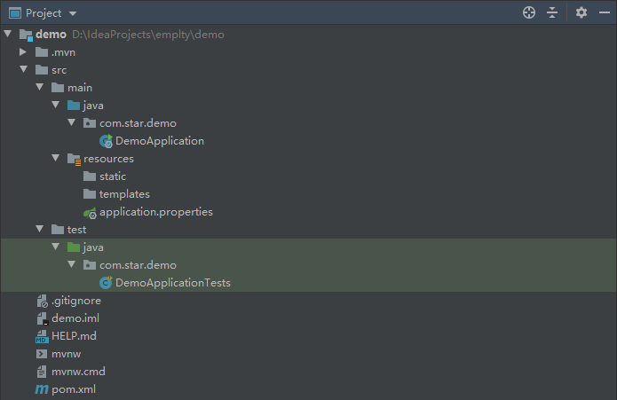

SpringBoot 官网：[https://spring.io/projects/spring-boot/](https://spring.io/projects/spring-boot/)

Spring Boot makes it easy to create stand-alone, production-grade Spring based Applications that you can "just run".


**目录**

1. [SpringBoot 介绍](#1springboot 介绍)

2. SpringBoot 依赖管理

3. SpringBoot Starter

4. SpringBoot AutoConfiguration

   


---

#### 1.SpringBoot 介绍

SpringBoot 由 Pivotal 团队在 2013 年开始研发、2014 年 4 月随着 Spring4.0 发布第一个版本，SpringBoot 是一个全新的开源的轻量级框架，它基于设计，不仅继承了 Spring 框架原有的优秀特性，而且还通过简化配置来进一步简化了 Spring 应用的整个搭建和开发过程。另外 SpringBoot 通过集成大量的框架使得依赖包的版本冲突，以及引用的不稳定性等问题得到了很好的解决。

SpringBoot 的特点：

- 独立的 Spring 应用程序。
- 直接嵌入Tomcat，Jetty 或 Undertow（无需部署 WAR 文件）。
- 提供可选择的 Starter 依赖，以简化项目搭建配置。
- 尽可能自动配置 Spring 和第三方代码库。
- 提供可用于生产的功能，例如指标，运行状况检查和外部化配置。
- 完全没有代码生成，也不需要 XML 配置。

Spring Boot 采用约定大于配置的思想，大大的简化了 Spring 应用开发，只需要极小的配置项就能创建一个独立的，产品级别的应用。


在 ***IDEA*** 中，我们可以使用 *Spring Initializer* 快速创建一个 *Spring Boot* 项目。

IDEA 中 SpringBoot 项目目录结构：



- `.mvn`：存放 *maven wrapper* 相关的文件及 jar 包，可删除。
- `src/main/java`：Java 文件存放路径。
  - `XxxApplication.class`：SpringBoot 程序的启动类。

- `src/main/resources`：静态资源文件存放路径。
  - `static`：静态资源目录，如 css/，js/，图片等资源。
  - `templates`：视图模板目录，如 jsp，thymeleaf 等。
  - `application.properties`：SpringBoot 默认生成的配置文件，也可以是 application.yml 等。
- `src/main/test`：测试类的存放目录。
- `.gitignore`：Git 的忽略文件，用来定义过滤文件规则。
- `xxx.iml`：Intellij Idea 的工程配置文件，里面是当前 project 的一些配置信息。
- `HELP.md`：帮助文档，内含 SpringBoot 项目的一些文档链接，可删除。
- `mvnw,mvnw.cmd`：*maven wrapper* 打包脚本，一般情况下用不到，可删除。
- `pom.xml`：maven 项目的依赖配置文件（**P**roject **O**bject **M**odel）。


Spring，SpringBoot 与 SpringCloud：

***Spring***：Spring 是一个从实际开发中抽取出来的框架，因此它完成了大量开发中的通用步骤，留给开发者的仅仅是与特定应用相关的部分，大大的提高了企业用的开发效率。

***SpringBoot***：SpringBoot 是 Spring 框架的扩展，它消除了设置 Spring 应用程序所需的复杂例行配置，帮助我么快速的搭建应用，简化开发过程。

***SpringCloud***：SpringCloud 是一个基于 SpringBoot 实现的微服务解决方案，主要用于微服务架构应用的开发。


---

#### 2.SpringBoot 依赖管理

在 SpringBoot 应用中，通过继承 SpringBoot 的提供的父工程来进行依赖管理。

在 `pom.xml` 文件中，声明了一个 ***parent*** 模块，即声明当前项目的父项目：

```xml
<parent>
   <groupId>org.springframework.boot</groupId>
   <artifactId>spring-boot-starter-parent</artifactId>
   <version>2.3.4.RELEASE</version>
   <relativePath/> <!-- lookup parent from repository -->
</parent>
```

在 `spring-boot-starter-parent` 中，SpringBoot 帮助我们管理一些项目的基础信息：

- 一些公共的项目属性：jdk 版本，字符集等

  ~~~xml
  <properties>
    <java.version>1.8</java.version>
    <resource.delimiter>@</resource.delimiter>
    <maven.compiler.source>${java.version}</maven.compiler.source>
    <maven.compiler.target>${java.version}</maven.compiler.target>
    <project.build.sourceEncoding>UTF-8</project.build.sourceEncoding>
    <project.reporting.outputEncoding>UTF-8</project.reporting.outputEncoding>
  </properties>
  ~~~

- 项目授权和作者信息：

  ~~~xml
  <licenses>
      ......
  </licenses>
  <developers>
      ......
  </developers>
  ~~~

- 项目构建模块：`<build>...</build>`

  - `<resources>...</resources>` ：声明配置文件位置，在打包时将配置文件打包到 jar 包内。
  - `<pluginManagement>...</pluginManagement>`：声明插件的各个信息，与 `<plugin>...</plugin>` 不同的是，*pluginManagement* 并不是真正的引入了项目插件，仅仅是对插件信息进行管理约束，提供给子项目进行使用，方便进行统一管理，当然，子项目也可以覆盖此信息。


在 `spring-boot-starter-parent` 中，还有一个父项目：

```xml
<parent>
  <groupId>org.springframework.boot</groupId>
  <artifactId>spring-boot-dependencies</artifactId>
  <version>2.3.4.RELEASE</version>
</parent>
```

 在 `spring-boot-dependencies` 中，SpringBoot 帮助我们管理应用中的依赖版本：

- `<properties></properties>`：此模块中定义了 SpringBoot 所管理的所有依赖版本。

  ~~~xml
  <properties>
    <activemq.version>5.15.13</activemq.version>
    <antlr2.version>2.7.7</antlr2.version>
    <appengine-sdk.version>1.9.82</appengine-sdk.version>
    <artemis.version>2.12.0</artemis.version>
    <aspectj.version>1.9.6</aspectj.version>
    <assertj.version>3.16.1</assertj.version>
    <atomikos.version>4.0.6</atomikos.version>
      ......
  </properties>  
  ~~~

- `<dependencyManagement>...</dependencyManagement>`：声明各个依赖的信息，与 *pluginManagement* 一样，这里并不会真正的引入依赖，而是对依赖信息进行管理约束，提供给子项目进行使用，方便进行统一管理，一样的，子项目也可以覆盖此信息。

  ~~~xml
  <dependencyManagement>
      <dependencies>
        <dependency>
          <groupId>org.apache.activemq</groupId>
          <artifactId>activemq-amqp</artifactId>
          <version>${activemq.version}</version>
        </dependency>
        <dependency>
          <groupId>org.apache.activemq</groupId>
          <artifactId>activemq-blueprint</artifactId>
          <version>${activemq.version}</version>
        </dependency>
          ...
      </dependencies>
  </dependencyManagement>
  ~~~

有了 SpringBoot 的自动依赖管理，我们导入SpringBoot 所管理的 jar 时，默认不需要填写版本号，当然，如果导入的依赖未在 *spring-boot-dependencies* 进行管理，我们还是需要填写版本号。

> 我们使用 *Spring Initializer* 创建 SpringBoot 项目时，可以直接选择自己所需要的模块，如果后续发现有未引入的依赖，可以在 `spring-boot-dependencies` 中查找相关依赖将其填入 pom.xml 中即可，不需要添加版本信息。


---

#### 3.SpringBoot Starter

在 SpringBoot 项目中包含了许许多多的 spring-boot-starter-xxx，我们称之为 SpringBoot 场景启动器，SpringBoot 将所有的功能抽取成一个个的场景启动器，我们只需要在项目中引入这些 *starter*，相关场景的依赖就都会导入进来并且统一由 SpringBoot 帮助我们进行版本管理。

以 `spring-boot-starter-web` 为例，在此 *starter* 的 pom 文件中，SpringBoot 会帮助我们导入 json，tomcat，web，webmvc 等相关依赖，我们无需额外导入其他依赖即可搭建一个基础的 web 应用。

例：spring-boot-starter-web 的 pom.xml 引入的相关依赖：

~~~xml
<dependencies>
    <dependency>
      <groupId>org.springframework.boot</groupId>
      <artifactId>spring-boot-starter</artifactId>
      <version>2.3.4.RELEASE</version>
      <scope>compile</scope>
    </dependency>
    <dependency>
      <groupId>org.springframework.boot</groupId>
      <artifactId>spring-boot-starter-json</artifactId>
      <version>2.3.4.RELEASE</version>
      <scope>compile</scope>
    </dependency>
    <dependency>
      <groupId>org.springframework.boot</groupId>
      <artifactId>spring-boot-starter-tomcat</artifactId>
      <version>2.3.4.RELEASE</version>
      <scope>compile</scope>
    </dependency>
    <dependency>
      <groupId>org.springframework</groupId>
      <artifactId>spring-web</artifactId>
      <version>5.2.9.RELEASE</version>
      <scope>compile</scope>
    </dependency>
    <dependency>
      <groupId>org.springframework</groupId>
      <artifactId>spring-webmvc</artifactId>
      <version>5.2.9.RELEASE</version>
      <scope>compile</scope>
    </dependency>
</dependencies>
~~~


---

#### 4.SpringBoot AutoConfiguration

SpringBoot 帮助我们引入相关依赖后，就会进一步帮助我们进行自动配置：

在 SpringBoot 主程序类上，有一个注解 `@SpringBootApplication`：

~~~java
@SpringBootApplication
public class DemoApplication {
	public static void main(String[] args) {
		SpringApplication.run(DemoApplication.class, args);
	}
}
~~~

此注解为组合注解：

~~~java
@Target(ElementType.TYPE)
@Retention(RetentionPolicy.RUNTIME)
@Documented
@Inherited
@SpringBootConfiguration
@EnableAutoConfiguration
@ComponentScan(excludeFilters = { @Filter(type = FilterType.CUSTOM, classes = TypeExcludeFilter.class),
		@Filter(type = FilterType.CUSTOM, classes = AutoConfigurationExcludeFilter.class) })
public @interface SpringBootApplication {
    ...
}
~~~

其中 `@EnableAutoConfiguration` 注解帮助我们开启了自动配置功能：

~~~java
@Target(ElementType.TYPE)
@Retention(RetentionPolicy.RUNTIME)
@Documented
@Inherited
@AutoConfigurationPackage
@Import(AutoConfigurationImportSelector.class)
public @interface EnableAutoConfiguration {
    ...
}
~~~

在 `@EnableAutoConfiguration` 中，也包含了两个注解：

- `@AutoConfigurationPackage`：此注解帮助我们向容器中注册自动配置的包名供后续过程引用。

  ~~~java
  @Target(ElementType.TYPE)
  @Retention(RetentionPolicy.RUNTIME)
  @Documented
  @Inherited
  @Import(AutoConfigurationPackages.Registrar.class)
  public @interface AutoConfigurationPackage {
      ...
  }
  ~~~

  在 *AutoConfigurationPackages.Registrar.class* 中，会将自动配置包名称进行注册。默认情况下注册的包为 *basePackages* 所指定的包名，如果未进行指定，则注册标注有 `@AutoConfigurationPackage` 注解的类所在的包（主程序所在包）。

- `@Import(AutoConfigurationImportSelector.class)`：在 *AutoConfigurationImportSelector* 中帮助我们选择需要自动配置的组件。

  在 方法中，选择需要加载的自动配置

  ~~~java
  protected AutoConfigurationEntry getAutoConfigurationEntry(AnnotationMetadata annotationMetadata) {
      if (!isEnabled(annotationMetadata)) {
          return EMPTY_ENTRY;
      }
      AnnotationAttributes attributes = getAttributes(annotationMetadata);
      //获取所有的候选自动配置
      List<String> configurations = getCandidateConfigurations(annotationMetadata, attributes);
      configurations = removeDuplicates(configurations);
      Set<String> exclusions = getExclusions(annotationMetadata, attributes);
      checkExcludedClasses(configurations, exclusions);
      //移除注解中指定的需要排除的自动配置(通过 exclude 属性指定)
      configurations.removeAll(exclusions);
      //过滤出当前应用所需要的那一部分自动配置
      configurations = getConfigurationClassFilter().filter(configurations);
      //触发自动配置导入事件
      fireAutoConfigurationImportEvents(configurations, exclusions);
      return new AutoConfigurationEntry(configurations, exclusions);
  }
  ~~~

  - 获取所有候选的自动配置：

    *getCandidateConfigurations(annotationMetadata, attributes);*

    ​		--> *SpringFactoriesLoader.loadFactoryNames(getSpringFactoriesLoaderFactoryClass(),getBeanClassLoader());*

    ​				--> *loadSpringFactories(classLoader).getOrDefault(factoryTypeName, Collections.emptyList());*

    *loadSpringFactories(classLoader)* 方法读取项目 jar 包的 `META-INF` 目录下的 `spring.factories` 文件，将文件中的配置信息加载进来并封装成一个 `Map<String, List<String>>` 返回，其中，键为一类组件的名称，值为该类组件所包含的所有具体组件的全路径集合。
    
    *loadSpringFactories(classLoader)* 返回的结果如图：		
    
    

    在 *spring.factories* 中定义了很多种组件类型，通过 *SpringFactoriesLoader.loadFactoryNames* 方法传入的 *FactoryClass* 参数（此处为*org.springframework.boot.autoconfigure.EnableAutoConfiguration*），通过 *getOrDefault(factoryTypeName, Collections.emptyList())* 将 *AutoConfiguration* 相关的组件提取出来，最终获取到所有候选的自动配置类。

  - 过滤需要的自动配置：

    *getConfigurationClassFilter().filter(configurations)*

    ​		--> *getConfigurationClassFilter()* --> *getAutoConfigurationImportFilters*

    ​				--> *SpringFactoriesLoader.loadFactories(AutoConfigurationImportFilter.class, this.beanClassLoader)*

    ​					 		...

    ​							--> *loadSpringFactories(classLoader).getOrDefault(factoryTypeName, Collections.emptyList());*

    同样地，此处获取到 `spring.factories` 中与 *org.springframework.boot.autoconfigure.AutoConfigurationImportFilter* 相关的过滤器组件，然后通过过滤器过滤出第一步获取到的候选自动配置，完成整个项目的自动配置。

- 加载了自动配置类后，由自动配置类帮助我们进行自动配置（以 *EmbeddedWebServerFactoryCustomizerAutoConfiguration* 为例）

  ~~~java
  @Configuration(proxyBeanMethods = false)
  @ConditionalOnWebApplication
  @EnableConfigurationProperties(ServerProperties.class)
  public class EmbeddedWebServerFactoryCustomizerAutoConfiguration {
      ...
  }
  ~~~

  在该自动配置类中，依赖了 `ServerProperties.class` 进行自动配置：

  ~~~java
  @ConfigurationProperties(prefix = "server", ignoreUnknownFields = true)
  public class ServerProperties {
  	private Integer port;
      
      ...
  }
  ~~~
  
  通过 `@ConfigurationProperties` 注解将配置信息中以 *server* 开头的配置信息与此类中的属性进行绑定，然后进行配置。
  
  > SpringBoot 容器启动时，会去项目的所有 jar 包下的 `META-INF` 目录下寻找 `spring-configuration-metadata.json` 文件，文件中包含了 SpringBoot 为我们所做的默认配置信息，如：
>
  > ~~~json
> {
  >     "name": "server.port",
  >     "type": "java.lang.Integer",
  >     "description": "Server HTTP port.",
  >     "sourceType": "org.springframework.boot.autoconfigure.web.ServerProperties",
  >     "defaultValue": 8080
  > }
  > ~~~


---

#### 5.SpringBoot 配置

SpringBoot 使用一个全局的配置文件，配置文件名是固定的：***application.properties***，***application.yml***。

我们可以在配置文件当中修改自动配置的默认值，SpringBoot 启动时就会根据配置文件中的相关信息进行应用配置。

配置文件放在 ***src/main/resources*** 目录或者类路径的 ***config*** 目录下。


> 在 IDEA 中，properties 文件的默认字符集为 GBK，如果配置项有中文则会出现乱码，可以在 Editor --> File Encodings 中更改默认字符集。


*YAML*（**Y**AML **A**in't a **M**arkup **L**anguage / **Y**et **A**nother **M**arkup **L**anguage），YAML 不是一种标记语言，但仍是另外的一种标记语言。

YAML 的语法和其他高级语言类似，并且可以简单表达清单、散列表，标量等数据形态。它使用。空格进行缩进，特别适合用来表达或编辑数据结构、各种配置文件、倾印调试内容、文件大纲等。YAML 的配置文件后缀为 ***.yml***，如：***application.yml*** 。

配置实例：

~~~yaml
server:
 port: 8080
~~~

YAML 的基本语法：

- 使用空格表示层级关系，空格可以多个，但同一层级的元素一定要左对齐。
- 对象键值对使用冒号加空格表示，**key: value**。
- 大小写敏感。
- 使用 **#** 表示注释。

YAML 支持的数据类型：

- 字面量：数字、字符串、布尔和日期键值对，如：***key: value***，默认字符串不需要加双引号（也可以加）并支持转义符；如果给字符串加上单引号，单引号中的特殊字符将会被转义为普通字符数据。

- 对象：对象有两种写法

  - 键值对集合：

    ~~~yaml
    user:
     name: James
     age: 25
    ~~~

  - 行内写法：

    ~~~yaml
    user: {name: James,age: 25}
    ~~~

- 数组：数组同样也有两种写法

  - 写法一：

    ~~~yaml
    pets: 
      - dog
      - cat
      - pig
    ~~~

  - 行内写法：

    ~~~yaml
    pets: [dog,cat,pig]
    ~~~

> YAML 文档块：YAML 支持将一个文档的内容进行切分，文档块之间使用 3 个横线进行切分
>
> ~~~yaml
> server:
>  port: 8081
>   
> ---
> 
> server:
>  port: 8083
> ~~~


SpringBoot 配置文件中值的获取：在 SpringBoot 中，可以通过 *@ConfigurationProperties*，*@Value* 注解获取配置文件中的值。

在开发中，我们可以引入 `spring-boot-configuration-processor`，可以帮助我们处理配置信息，在编写配置文件时给出提示等。

~~~xml
<dependency>
   <groupId>org.springframework.boot</groupId>
   <artifactId>spring-boot-configuration-processor</artifactId>
   <optional>true</optional>
</dependency>
~~~


- `@ConfigurationProperties`：标注在类中，将配置文件中的属性值与注入到类的同名属性值中。

  ```java
  @Data
  @Component
  @ConfigurationProperties(prefix = "user")
  public class SysUser {
      private String username;
      private LocalDate birthday;
      private List<String> pets;
  	//将字符串绑定到 LocalDate 属性上
      public void setBirthday(String date){
          this.birthday = LocalDate.parse(date);
      }
  }
  ```

  - 要获取配置文件中的属性值，标注此注解的类必须加入到 SpringBoot 容器中进行管理。
  - 在 *@ConfigurationProperties* 注解中必须指定属性前缀，容器才能识别对应属性。
  - 当 JavaBean 中含有复杂对象属性时，可以改写属性的 set 方法将配置文件中的值绑定到该属性上。

  配置文件：

  ```yaml
  user:
    username: Niko
    birthday: 1920-11-08
    pets:
      - dog
      - cat
  ```

- `@Value`：标注在属性上，将为该属性赋值。

  ```java
  @Data
  @Component
  @ConfigurationProperties(prefix = "user")
  public class SysUser {
      @Value("${user.username}")
      private String username;
      @Value("#{T(java.time.LocalDate).parse('${user.birthday}')}")
      private LocalDate birthday;
      @Value("${user.pets}")
      private List<String> pets;
  }
  ```

  配置文件：

  ```yaml
  user:
    username: Niko
    birthday: 1995-11-08
    pets: dog,cat
  ```

  ***@Value*** 中支持的写法：

  - 字面量（支持运算符）：@Value("hello")，@Value("5+3")，@Value("5 > 3 ? 1 : 0") 等。
  - ${} + 属性值：${user.username}，与配置文件中的属性值绑定。
  - #{} + ***spel*** 表达式：[spel 官网地址](https://docs.spring.io/spring-framework/docs/4.2.x/spring-framework-reference/html/expressions.html)，在 spel 表达式中，我们可以使用容器中的组件，调用其方法，也可以调用静态方法，静态变量，同时也支持运算符，可以获取数组元素 `#{array[0]}`，还可以直接 new 对象进行方法调用 `#{new Xxx().xxx()}`。

  > `@Value` 无法识别 yaml 配置文件中的数组等复杂数据结构，只能将数组写为逗号分割的字符串进行识别，或者使用 *ConfigurationProperties* 进行注入。

 *@ConfigurationProperties* 与 *@Value* 的区别：

| 功能                                         | *@ConfigurationProperties* | *@Value* |
| -------------------------------------------- | -------------------------- | -------- |
| 属性松散绑定（下划线，短横线，驼峰相互转换） | 支持                       | 不支持   |
| spel 表达式                                  | 不支持                     | 支持     |
| JSR303 数据校验                              | 支持                       | 不支持   |
| 复杂数据类型封装                             | 支持                       | 不支持   |


外部配置文件引入：

- `@PropertySource(value = {"classpath:user.properties"})`：将外部的配置文件与当前类进行绑定，然后配合 *@ConfigurationProperties*，*@Value* 进行使用。

  ```java
  @Data
  @Component
  @ConfigurationProperties(prefix = "user")
  @PropertySource(value = {"classpath:user.properties"})
  public class SysUser {
      private String username;
      private LocalDate birthday;
      private List<String> pets;
  
      public void setBirthday(String date){
          this.birthday = LocalDate.parse(date);
      }
  }
  ```

  此时 user 的相关配置写在了单独的 *user.properties* 文件中。

- `@ImportResource(locations = {"classpath:beans.xml"})`：引入 spring 的配置文件（只能是 xml 文件），将此注解标注在配置类上，该配置文件就会生效。

  ```xml
  <?xml version="1.0" encoding="UTF-8"?>
  <beans xmlns="http://www.springframework.org/schema/beans"
         xmlns:xsi="http://www.w3.org/2001/XMLSchema-instance"
         xsi:schemaLocation="http://www.springframework.org/schema/beans http://www.springframework.org/schema/beans/spring-beans.xsd">
      <beans>
          <bean class="com.star.demo.config.SysUser" id="myUser">
              <property name="username" value="star"/>
              <property name="birthday" value="1995-09-20"/>
              <property name="pets" value="dog,cat,pig"/>
          </bean>
      </beans>
  </beans>
  ```

  主配置类：

  ```java
  @SpringBootApplication
  @ImportResource(locations = {"classpath:beans.xml"})
  public class DemoApplication {
  
     public static void main(String[] args) {
        SpringApplication.run(DemoApplication.class, args);
     }
  
  }
  ```

  此时，容器中就添加进来了 id 为 myUser 的组件（在 SpringBoot 中，可以直接使用 @Bean 向容器中添加组件）。


配置文件占位符：在 properties 或 yml 配置文件中，我们可以使用 ***${}*** 来做配置文件占位符使用。

- 使用随机数函数：

  ```properties
  user.birthday=1995-11-${random.int(10,30)}
  ```

  还有另外的随机函数，在 IDEA 中会进行提示。

- 使用其他配置项：

  ```properties
  user.username=Niko
  user.description=${user.username} is an excellent programmer
  ```

- 指定默认值：

  ```properties
  user.description=${user.username:James} is an excellent programmer
  ```

  使用当未定义 user.username 的值时，则使用 James 作为此表达式的值。


SpringBoot 多配置文件 Profile：Profile 是 Spring 对不同环境提供不同配置功能的支持，可以通过激活、指定参数等方式快速切换环境。

可以使用多文件（application-xxx.properties）或多文档块（application.yml）的方式实现多环境：

指定方式：

```properties
spring.profiles=prod
```

激活方式：

- 在主配置文件中或者 yml 文件的第一个文档块中进行指定

  ~~~properties
  spring.profiles.active=prod
  ~~~

- 使用命令行参数：

  ~~~shell
  [root@localhost ~]# nohup java -jar demo-0.0.1-SNAPSHOT.jar --spring.profiles.active=prod
  ~~~

- 使用 jvm 参数：

  ~~~properties
  –Dspring.profiles.active=prod
  ~~~

  

SpringBoot 配置加载位置：

官方文档介绍：[官方文档](https://docs.spring.io/spring-boot/docs/2.3.4.RELEASE/reference/htmlsingle/#boot-features-external-config)

内部配置：

- 


---

#### 6.SpringBoot 日志


---

#### 7.SpringBoot Web


---

#### 8.SpringBoot 数据访问