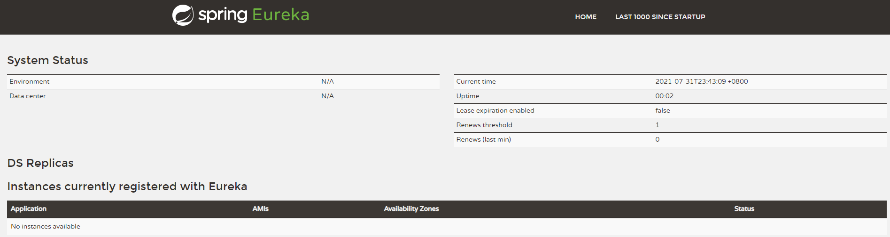
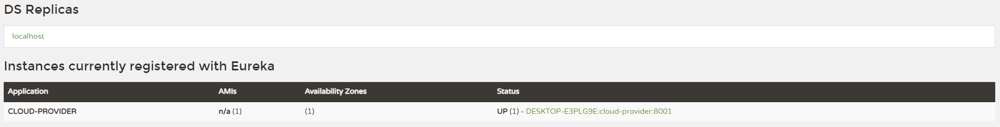
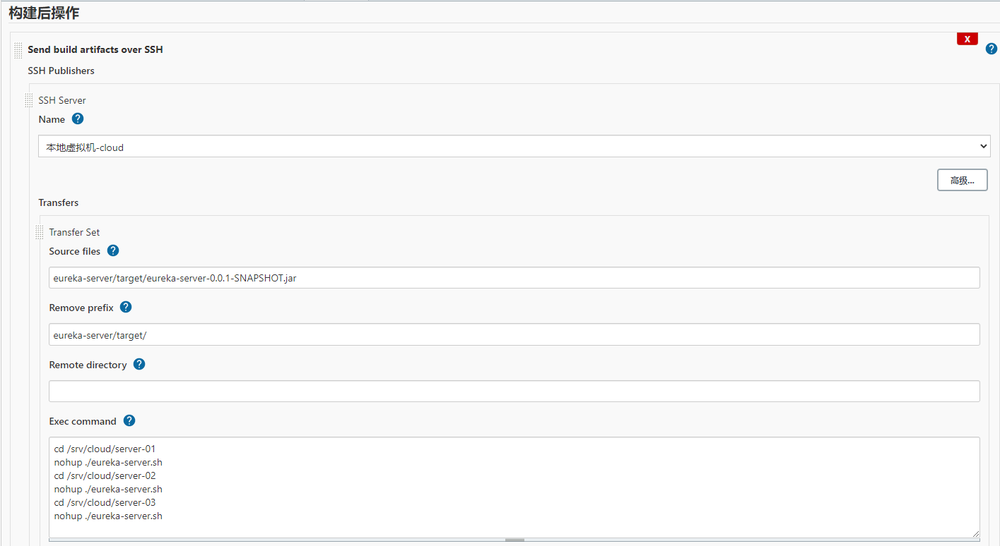

:cloud: **SpringCloud**


---

#### 1.微服务概述

在过去，企业的应用程序一般以传统的单体应用为主，随着互联网的不断发展，单体应用逐渐出现了下面的问题：

1. 系统间（例如：订单系统、库存系统）通常以 API 的形式互相访问，耦合紧密导致难以维护；
2. 各业务领域需要采用相同的技术栈，难以快速应用新技术；
3. 对系统的任何修改都必须整个系统一起重新部署/升级，系统更新成本高；
4. 在系统负载增加时，难以进行水平扩展；
5. 当系统中一处出现问题，可能会影响到整个系统；

这些原因导致了微服务架构风格的出现。


什么是微服务？

微服务的概念最早由来自于英格兰的 Martin Fowler 提出，它是一种 "**架构模式**"，原博文地址：https://martinfowler.com/articles/microservices.html。它提倡将单⼀应⽤程序划分成⼀组⼩的服务，每个服务运⾏在自己独⽴的进程中，甚至不同服务还可以使用不同的语言进行开发；服务之间采用轻量级的通信机制（<u>RESTful API</u>）互相协调、互相配合，为⽤户提供最终价值。

> :oncoming_taxi: 通俗地讲，微服务化就是将传统的一站式应用 <u>根据业务拆分</u> 成一个一个的服务，彻底地去耦合。每一个微服务只做一件事，能够单独地启动或销毁，并且拥有自己独立的数据库。


微服务的优点：

1. **单一职责**：每个微服务足够内聚，足够小，只聚焦一个指定的业务功能，开发简单。
2. **松耦合**：一个微服务就是一个独立的实体，它可以<u>独立地进行开发、部署、升级和扩展</u>。

微服务的缺点：

1. **技术栈复杂**：微服务间通过 REST、RPC 等形式交互，需要考虑被调用方故障、过载、消息丢失等各种异常情况，代码逻辑更加复杂；同时，微服务的事务机制也更加复杂。
2. **运维复杂**：运行多个独立的微服务使运维的难度增加，需要运维人员对各个微服务的运行状态进行监控，运维压力增大。


---

#### 2.SpringCloud

作为一种流行的架构思想，微服务诞生了很多的落地实现，其中 Dubbo 和 SpringCloud 最为流行。

Dubbo 和 SpringCloud 的区别：

1. Dubbo 主要是提供服务通信与微服务治理两大关键能力，还需要结合其他组件进行使用（如：Zookeeper 等）；而 SpringCloud 是一整套的微服务架构解决方案。

2. 服务调用方式：Dubbo 使用 RPC 方式进行远程调用，而 SpringCloud 使用 RESTful API 进行远程调用。

   > RPC（Remote Procedure Call）：远程过程调用，就是像调用本地方法一样调用远程方法，即通过接口进行远程调用，耦合性较强，但性能较好。
   >
   > RESTful API：即 HTTP 调用，不用关心接口实现细节，耦合性较低，但性能不如 RPC 高。

Dubbo 和 SpringCloud 如何抉择：

1. RPC 适用于内网服务调用，对外提供服务需要使用 RESTful API。
2. RPC 适用于服务调用密集与复杂的系统（如大型电商系统），如果服务频次较低则使用 RESTful API。

> :card_index: 目前，阿里巴巴开源中间件与 SpringCloud 体系进行融合诞生了 **SpringCloud Alibaba**，一个以 Dubbo 的 RPC 调用为基础的微服务一站式解决方案。


SpringCloud 微服务技术实现：

| 微服务技术栈                                                 | SpringCloud 技术实现                    |
| ------------------------------------------------------------ | --------------------------------------- |
| 服务注册与发现                                               | Netflix Eureka                          |
| 服务调用                                                     | Rest、Feign(接口化调用)                 |
| 服务熔断                                                     | Hystrix                                 |
| 云端负载均衡                                                 | Ribbon、Feign                           |
| 配置中心                                                     | Spring Cloud Config(小规模场景)、Apollo |
| 数据流处理（封装了 Redis、Rabbit、Kafka 等数据流操作）       | Spring Cloud Stream                     |
| 服务路由（提供动态路由，监控，弹性，安全等边缘服务）         | Zuul、Spring Cloud Gateway(新)          |
| 服务监控                                                     | Turbine                                 |
| 事件、消息总线（用于在集群中传播事件，如：配置文件发生改变等） | Spring Cloud Bus                        |
| 安全工具包                                                   | Spring Cloud OAuth2                     |


> :bullettrain_side: SpringCloud 官网：https://spring.io/cloud
>
> :blue_car: SpringCloud 中文网：https://www.springcloud.io


---

#### 3.SpringCloud 项目搭建

SpringCloud 的总体架构就是一个父 Project 带着多个 Module 子模块，每个子模块就是一个微服务；

父 Project 主要用来管理整个微服务项目的 jar 包，它定义一个父工程的 POM 文件，用来聚合工程和管理依赖。

> SpringCloud 各种实例代码：https://github.com/spring-cloud-samples/


1. 使用 Spring Initialzr 构建一个空的 Maven 父工程，<u>打包方式选择 pom</u>，完整 pom.xml 文件如下：

   ~~~xml
   <?xml version="1.0" encoding="UTF-8"?>
   <project xmlns="http://maven.apache.org/POM/4.0.0" xmlns:xsi="http://www.w3.org/2001/XMLSchema-instance"
   	xsi:schemaLocation="http://maven.apache.org/POM/4.0.0 https://maven.apache.org/xsd/maven-4.0.0.xsd">
   	<modelVersion>4.0.0</modelVersion>
   	<groupId>com.star</groupId>
   	<artifactId>cloud</artifactId>
   	<version>0.0.1-SNAPSHOT</version>
   	<name>cloud</name>
   	<description>Demo project for Spring Cloud</description>
   	<packaging>pom</packaging>
   
   	<properties>
   		<java.version>1.8</java.version>
   		<spring-cloud.version>2020.0.3</spring-cloud.version>
   		<spring-boot.version>2.5.3</spring-boot.version>
   	</properties>
   
   	<dependencyManagement>
   		<dependencies>
   			<dependency>
   				<groupId>org.springframework.cloud</groupId>
   				<artifactId>spring-cloud-dependencies</artifactId>
   				<version>${spring-cloud.version}</version>
   				<type>pom</type>
   				<scope>import</scope>
   			</dependency>
   			<dependency>
   				<groupId>org.springframework.boot</groupId>
   				<artifactId>spring-boot-dependencies</artifactId>
   				<version>${spring-boot.version}</version>
   				<type>pom</type>
   				<scope>import</scope>
   			</dependency>
   		</dependencies>
   	</dependencyManagement>
   </project>
   ~~~
   
   使用 dependencyManagement 节点来管理子模块的 SpringBoot 版本和 SpringCloud 版本。
   
   
   
2. 创建公共 API 模块，用来保存都会用到的公共组件（如：统一返回类 Result、工具类、及其他组件）：

   在父项目上右键添加 Module，创建 Maven 子模块，在 pom.xml 中添加常用的功能（如：lombok、hutool 等）。

   ~~~xml
   <dependencies>
       <dependency>
           <groupId>cn.hutool</groupId>
           <artifactId>hutool-all</artifactId>
           <version>5.7.6</version>
       </dependency>
       <dependency>
           <groupId>org.projectlombok</groupId>
           <artifactId>lombok</artifactId>
           <!-- 允许将此依赖传递到其他模块中  -->
           <optional>false</optional>
       </dependency>
   </dependencies>
   ~~~

   创建好公共 API 模块后，再创建一个 Dept 实体类供后续使用（注意：<u>微服务中实体类需要实现 Serializable 接口</u>）。

   

3. 创建服务提供者 cloud-provider：

   在父项目上使用 Spring Initialzr 创建子模块，勾选需要的功能（如：web，MySQL、MyBatis、Druid 等）。

   修改子模块的 parent 并且在父工程的 modules 标签中添加此模块。

   进行 application.properties 配置（端口、数据库、连接池、MyBatis 等），配置如下：

   ~~~properties
   # 服务端口号
   server.port=8001
   # 服务名称，部署至 Eureka 时需要用到
   spring.application.name=cloud-provider
   # 数据库连接信息
   spring.datasource.type=com.alibaba.druid.pool.DruidDataSource
   spring.datasource.driver-class-name=com.mysql.cj.jdbc.Driver
   spring.datasource.url=jdbc:mysql://192.168.253.128:3306/cloud?serverTimezone=UTC
   spring.datasource.username=root
   spring.datasource.password=TinyStar0920
   # MyBatis 配置信息
   mybatis.mapper-locations=classpath:mapper/**
   mybatis.configuration.map-underscore-to-camel-case=true
   #热部署生效
   spring.devtools.restart.enabled=true
   #设置重启的目录
   spring.devtools.restart.additional-paths=src/main/java
   ~~~

   配置完成后，创建相应的数据库、controller、service、mapper 并进行初步测试。


4. 创建服务消费者模块 cloud-consumer：

   在父项目上使用 Spring Initialzr 创建子模块，并勾选 web 功能。

   修改子模块的 parent 并且在父工程的 modules 标签中添加此模块。

   进行 application.properties 配置（端口、数据库、连接池、MyBatis 等），配置如下：

   ~~~properties
   # 服务端口号
   server.port=9001
   # 服务名称，部署至 Eureka 时需要用到
   spring.application.name=cloud-consumer
   ~~~

   向容器中注入一个 **RestTemplate**：

   ~~~java
   @Configuration
   public class BeanConfig {
       @Bean
       public RestTemplate restTemplate() {
           return new RestTemplate();
       }
   }
   ~~~

   > :rescue_worker_helmet: RestTemplate 提供了多种便捷访问远程 Http 服务的方法，它是一种简单便捷的访问 restful 服务的模板类。是 Spring 封装的用于访问 Rest 服务的客户端模板工具。

   编写 Controller，通过 RestTemplate 从 cloud-provider 获取 Dept 信息：

   ~~~java
   @RestController
   @RequestMapping("/dept")
   public class DeptConsumerController {
   
       private static final String REST_URL_PREFIX = "http://localhost:8001";
   
       @Autowired
       private RestTemplate restTemplate;
   
       @GetMapping("/{id}")
       public Dept getDeptById(@PathVariable int id) {
           return restTemplate.getForObject(REST_URL_PREFIX + "/dept/" + id, Dept.class);
       }
   }
   ~~~

   搭建完成后，在 cloud-consumer 发起请求，如果能接收到 cloud-provider 提供的正确查询结果，则项目初步搭建成功。


---

#### 4.Eureka 服务注册与发现

Eureka 是 Netflix 的一个子模块，也是核心模块之一。它基于 REST 服务来注册和发现服务，以实现云端中间层服务发现和故障转移。

系统启动时，服务提供方将自身服务注册到 Eureka，而服务消费方从 Eureka 获取注册的服务列表，从而消费服务。


Eureka 包含了 EurekaServer 和 EurekaClient 两个组件，它们的运行逻辑如下：

- Eureka 采用了 C-S 的设计架构。EurekaServer 作为服务注册功能的服务器，它是服务注册中心。
- 系统中的其他微服务，使用 Eureka 的客户端连接到 EurekaServer 并维持心跳连接。

> :tophat: 通过 EurekaServer 和 EurekaClient 的连接，系统的维护人员就可以通过 EurekaServer 来监控系统中各个微服务是否正常运行。系统中的其他一些模块（如：Zuul）也可以通过 EurekaServer 来发现系统中的其他微服务，并执行相关的逻辑。
>
> :horse_racing: EurekaClient 具备一个内置的、使用轮询负载算法的负载均衡器，它在应用启动后将会向 EurekaServer 发送心跳（默认周期为 30 秒），如果EurekaServer 在多个心跳周期内没有接收到某个节点的心跳，EurekaServer 将会从服务注册表中把这个节点移除（默认 90 秒）。


搭建 Eureka 服务注册中心：

1. 搭建 EurekaServer：

   在父项目上使用 Spring Initialzr 创建子模块，并勾选 Eureka Server、web 功能。

   修改子模块的 parent 并且在父工程的 modules 标签中添加此模块。

   配置 eureka-server 的 application.properties 文件：
   
   ~~~properties
   # Eureka Server 端口
   server.port=7001
   # Eureka Server 实例名称
   spring.application.name=eureka-server
   # 单机版本时，由于本服务就是服务注册中心，所以不向服务注册中心注册自己
   eureka.client.register-with-eureka=false
   # 单机版本时，本服务就是服务注册中心，不需要向服务注册中心获取服务列表
   eureka.client.fetch-registry=false
   # Eureka Server 启动后会不断地与服务中心进行连接，所以需要指明服务注册中心地址(本服务)，否则将一直打印日志错误(不影响服务)
   eureka.client.service-url.defaultZone=http://localhost:${server.port}/eureka
   ~~~
   
   主启动类上标注注解：**<u>@EnableEurekaServer</u>**
   
   ~~~java
@EnableEurekaServer
   @SpringBootApplication
public class EurekaServerApplication {
       public static void main(String[] args) {
        SpringApplication.run(EurekaServerApplication.class, args);
       }
   }
   ~~~
   
   启动项目后，访问 http://localhost:7001/ 将会看到 Eureka 服务注册中心。
   
   
   
2. 将 cloud-provider 注册到 EurekaServer 中：

   向 cloud-provider 的 pom.xml 中添加依赖：

   ~~~xml
   <dependency>
       <groupId>org.springframework.cloud</groupId>
       <artifactId>spring-cloud-starter-netflix-eureka-client</artifactId>
   </dependency>
   ~~~

   在 cloud-provider 中加入 Eureka Client 配置：

   ~~~properties
   # 将此服务注册到 Eureka Server 中
   eureka.client.service-url.defaultZone=http://localhost:7001/eureka
   ~~~

   在主启动类上标注注解：**<u>@EnableEurekaClient</u>**。
   
   先启动 eureka-server，再启动 cloud-provider 即可在配置中心的服务列表上查看到 cloud-provider 服务。
   
   


服务注册完善：

1. 默认服务名称的修改（服务列表中 Status 栏下面的名称）：

   ```properties
   # 服务实例名称，将会展示到 Eureka Server 的服务列表
   eureka.instance.instance-id=cloud-provider-8001
   ```

2. 在服务列表的链接 hover 中显示具体的 IP 地址：

   ```properties
   # 在 Eureka Server 的服务列表中的名称 hover 时显示具体的 IP 地址
   eureka.instance.prefer-ip-address=true
   ```

3. 服务注册信息完善（点击服务列表的超链接即可跳转显示）：

   添加 spring-boot-starter-actuator 依赖（用于监控服务以及管理服务信息）。

   ~~~xml
   <dependency>
       <groupId>org.springframework.boot</groupId>
       <artifactId>spring-boot-starter-actuator</artifactId>
   </dependency>
   ~~~

   在 cloud-provider 暴露 actuator 接口，配置服务信息：

   ~~~properties
   # 暴露 actuator 监控的接口
   management.endpoints.web.exposure.include=health,info
   # 添加此微服务的详细信息
   info.app-name=cloud-provider
   ~~~

   重启后，在点击服务列表中的超链接，即可看到配置文件中配置的服务信息。

   

> :european_castle: Eureka 自我保护机制:
>
> 默认情况下，如果 EurekaServer 在一定时间内没有接收到某个微服务实例的心跳，EurekaServer 将会注销该实例（默认90秒）。但是当网络分区故障发生时，在短时间内 EurekaServer 可能会丢失过多客户端，此时 Eureka 将会开启 "自我保护模式"。
>
> 进入自我保护模式后，EurekaServer 就会保护服务注册表中的信息，不再删除服务注册表中的数据（也就是不会注销任何微服务）。
>
> 当 EurekaServer 收到的心跳数重新恢复到阈值以上时会自动退出自我保护模式。
>
> 在 SpringCloud 中，可以配置 eureka.server.enable-self-preservation=false 来禁用自我保护模式（不推荐）。


在代码中如何获取注册中心的服务列表？

当主启动类上标注了注解 **@EnableEurekaClient** 时，此服务即可被其他服务所发现。同时 SpringCloud 支持在代码中获取服务注册中心的服务列表：

~~~java
@Autowired
private EurekaDiscoveryClient discoveryClient;

@GetMapping("/discovery")
public List<ServiceInstance> getDiscovery() {
    List<String> services = discoveryClient.getServices();
    return services.stream()
        .map(service -> discoveryClient.getInstances(service))
        .flatMap(Collection::stream)
        .collect(Collectors.toList());
}
~~~

在 SpringCloud 中，通过 EurekaDiscoveryClient 组件对 "服务发现" 相关业务进行操作。


> :currency_exchange: Eureka 服务器没有后端存储，但注册中心中的服务实例都必须发送心跳以保持其注册最新。
>
> Eureka 客户端也有一个 Eureka 注册的内存缓存（因此他们不必为每个服务请求都去注册中心）。


---

#### 5.Eureka 集群配置

为了保证注册中心的高可用，往往需要搭建 Eureka 集群进行使用。


Eureka 集群搭建：

1. 复制 application.properties 文件配置不同的 3 个节点。

   application-node-1.properties、application-node-2.properties、application-node-3.properties

2. 修改 application-node-1.properties 文件内容：

   ```properties
   # Eureka Server 端口
   server.port=7001
   # Eureka Server 实例名称
   spring.application.name=eureka-server-1
   # Eureka Server 实例 IP 地址
   eureka.instance.hostname=eureka-01
   # 配置 Eureka Server 集群中的其他 Server
   eureka.client.service-url.defaultZone=http://eureka-02:7002/eureka,http://eureka-03:7003/eureka
   ```

   > 一般来说，在搭建 Eureka 集群时，**hostname** 和 **defaultZone** 都直接写 IP 地址，如：
   >
   > `eureka.instance.hostname=192.168.253.127`、`eureka.client.service-url.defaultZone=http://192.168.253.128:7001/eureka`
   >
   > 集群中每一个 hostname 都不一样（集群搭建在不同的服务器上）。
   >
   > 但是在搭建单机集群时（集群搭建在一个服务器上），由于 Eureka 集群是通过 hostname 来区分彼此，所以我们需要配置不同的 hostname 并且在 hosts 文件中映射至本机 IP，然后在配置文件中进行使用。

   按照实例继续修改 application-node-2.properties、application-node-3.properties 的内容。

3. 在 Linux 中创建 3 个集群节点运行目录，编写服务启动脚本

   ~~~shell
   [root@localhost cloud]# cd /srv/cloud
   [root@localhost cloud]# mkdir server-01
   [root@localhost cloud]# mkdir server-02
   [root@localhost cloud]# mkdir server-03
   ~~~

   编写 shell 脚本：

   ~~~shell
   #!/bin/bash
   jarFile=eureka-server-0.0.1-SNAPSHOT.jar
   profileConfig=spring.profiles.active=node-1
   pid=$(ps -ef | grep "$jarFile --$profileConfig" | grep -v grep | awk '{print $2}')
   if [ -n "$pid" ];then
           kill -9 $pid
   fi
   nohup java -jar ../$jarFile --$profileConfig &
   ~~~

4. 配置 jenkins，通过 jenkins 将 Eureka 集群发布在虚拟机中：

   

   确认防火墙端口开启后，在外部浏览器输入 http://192.168.253.128:7001/ 即可查看集群状况。

5. 配置 cloud-provider 的注册中心地址：

   ~~~properties
   eureka.client.service-url.defaultZone=http://erueka-01:7001/eureka，http://erueka-02:7002/eureka，http://erueka-03:7003/eureka
   ~~~


---

#### 6.Nacos 注册中心

Nacos 是阿里巴巴旗下的开源微服务管理配置平台，帮助我们发现、配置和管理微服务。Nacos 提供了一组简单易用的特性集，帮助您快速实现动态服务发现、服务配置、服务元数据及流量管理。

Nacos 主要的功能有：

1. 服务发现和服务健康监测。
2. 动态配置服务。
3. 动态 DNS 服务。
4. 服务及其元数据管理。


Nacos 安装：

1. 安装 Java 环境：

   ~~~shell
   [root@localhost ~]# dnf install java-1.8.0-openjdk-devel.x86_64
   ~~~

2. 下载 Nacos server 安装包：https://github.com/alibaba/nacos/releases，下载 zip 压缩包（非源码包）并解压到 Linux 目录。

3. 在 nacos 的 bin 目录下运行命令启动服务：

   ~~~shell
   [root@localhost ~]# sh startup.sh -m standalone
   ~~~

   此时服务在 8848 端口启动。

4. 关闭 Linux 的 8848 和 9848 端口对应防火墙。

   > :zap: 9848 端口的访问权限也必须开启，否则服务将无法注册到 Nacos。
   >
   > 原因：GrpcClient.connectToServer() 方法中 createNewChannelStub 的时候，实际上加了一个 rpcPortOffset，这个值在 GrpcSdkClient 中是 1000。

5. 此时，可以访问 `ip:8848/nacos` 进入到 Nacos 提供的可视化界面，用户名和密码均为 nacos。


使用 Nacos 作为注册中心：

1. 在公共模块引入依赖管理：

   ~~~xml
   <dependencyManagement>
       <dependencies>
           <dependency>
               <groupId>com.alibaba.cloud</groupId>
               <artifactId>spring-cloud-alibaba-dependencies</artifactId>
               <version>2.2.7.RELEASE</version>
               <type>pom</type>
               <scope>import</scope>
           </dependency>
       </dependencies>
   </dependencyManagement>
   ~~~

   指定整个项目的 spring-cloud-alibaba 微服务版本。

2. 引入 Nacos Discovery starter：

   ~~~xml
   <dependency>
       <groupId>com.alibaba.cloud</groupId>
       <artifactId>spring-cloud-starter-alibaba-nacos-discovery</artifactId>
   </dependency>
   ~~~

3. 使用 @EnableDiscoveryClient 注解开启应用的服务注册与发现功能。

4. 配置 Nacos 服务地址，并为应用起一个名称：

   ~~~properties
   spring.application.name=MEMBER
   spring.cloud.nacos.discovery.server-addr=192.168.253.136:8848
   ~~~

5. 启动应用后 ，即可在 Nacos 可视化界面看到注册到 Nacos 的服务。


---

#### 7.使用 OpenFeign 调用远程服务

使用步骤：

1. 引入 Feign 和负载均衡依赖（高版本中，feign 要结合 loadbalancer 进行使用）：

   ~~~xml
   <dependency>
       <groupId>org.springframework.cloud</groupId>
       <artifactId>spring-cloud-starter-openfeign</artifactId>
   </dependency>
   <dependency>
       <groupId>org.springframework.cloud</groupId>
       <artifactId>spring-cloud-starter-loadbalancer</artifactId>
   </dependency>
   ~~~

2. 调用方声明 feign 调用接口，例如调用优惠券的接口：

   ~~~java
   @RequestMapping("/sale/sale-coupon")
   public class SaleCouponController {
       @RequestMapping("/test")
       public R test() {
           SaleCouponEntity coupon = new SaleCouponEntity();
           coupon.setAmount(BigDecimal.valueOf(20L));
           coupon.setCouponName("12.12 满 200 减 20 优惠");
           return R.ok().put("orderMsg", coupon);
       }
   }
   ~~~

   则声明对应的 feign 接口为：

   ~~~java
   @FeignClient("SALE")
   public interface CouponFeignService {
       @RequestMapping("/sale/sale-coupon/test")
       R test();
   }
   ~~~

3. 开启应用的远程调用功能：`@EnableFeignClients(basePackages = "com.star.gmall.member.feign")`

4. 在需要用到 coupon 的地方注入 CouponFeignService 进行使用：

   ~~~java
   @RestController
   @RequestMapping("/member/member-msg")
   public class MemberMsgController {
       @Autowired
       private CouponFeignService couponFeignService;
   
       @RequestMapping("/test")
       public R list(){
           R test = couponFeignService.test();
           return R.ok().put("coupon", test.get("coupon"));
       }
   }
   ~~~

> :closed_umbrella: 注意：使用 loadbalancer 时必须排除 Nacos 包含的 Ribbon，否则会报错
>
> ~~~xml
> <dependency>
>     <groupId>com.alibaba.cloud</groupId>
>     <artifactId>spring-cloud-starter-alibaba-nacos-discovery</artifactId>
>     <!-- Nacos 中的  Ribbon 会使 loadbalancer 失效，必须进行排除 -->
>     <exclusions>
>         <exclusion>
>             <groupId>org.springframework.cloud</groupId>
>             <artifactId>spring-cloud-starter-netflix-ribbon</artifactId>
>         </exclusion>
>     </exclusions>
> </dependency>
> ~~~


---

#### 8.Nacos 配置中心

Nacos 配置示例：

1. 引入 nacos config 依赖：

   ~~~xml
   <!-- 必须引入此依赖，bootstrap.properties 文件才会生效 -->
   <dependency>
       <groupId>org.springframework.cloud</groupId>
       <artifactId>spring-cloud-starter-bootstrap</artifactId>
   </dependency>
   <dependency>
       <groupId>com.alibaba.cloud</groupId>
       <artifactId>spring-cloud-starter-alibaba-nacos-config</artifactId>
   </dependency>
   ~~~

2. 在 bootstrap.properties 配置 Nacos 地址：

   ~~~properties
   # 配置发布的 data ID 前缀，后缀默认是 properties
   spring.cloud.nacos.config.prefix=member
   # 配置中心地址
   spring.cloud.nacos.config.server-addr=192.168.253.136:8848
   ~~~

   > :alembic: 在 SpringBoot 项目中，bootstrap.properties 的优先级高于 application.properties，Bootstrap 属性有高优先级，默认情况下，它们不会被本地配置覆盖，因此把 config server 信息放在 bootstrap.properties，用来加载重要的配置信息。

3. 自定义配置信息用于测试：

   ~~~properties
   # 自定义配置
   root.member.name=JackMa
   ~~~

   在 controller 中进行使用：

   ~~~java
   @RefreshScope
   @RestController
   @RequestMapping("/member/member-msg")
   public class MemberMsgController {
       @Autowired
       private CouponFeignService couponFeignService;
       @Value("${root.member.name}")
       private String rootMemberName;
   
       @RequestMapping("/test")
       public R list(){
           R test = couponFeignService.test();
           return R.ok().put("coupon", test.get("coupon")).put("root-member", rootMemberName);
       }
   }
   ~~~

   注意：一定要加上 `@RefreshScope` 注解，在每次请求时才会去配置中心获取最新的配置信息。

4. 在 Nacos 配置列表界面添加要修改的配置内容，重新请求接口即可发现变化。


Nacos 配置中心基本概念：

- 命名空间：用来进行配置隔离，默认的命名空间为 public，一般用来隔离不同的微服务

  1. 在 Nacos 管理界面新建命名空间。

  2. 在应用的 bootstrap.properties 中指定命名空间的 ID。

     ~~~properties
     spring.cloud.nacos.config.namespace=2dc01f5d-3771-45a9-ab2a-5565df4d4f71
     ~~~

- 配置集：一组相关的或不相关的配置集合称为配置集（例如一个配置文件中的所有配置项）。

- 配置集 ID：Nacos 中某个配置集的 ID。

- 配置分组：可以建立不同分组的同一个配置集 ID，然后在配置文件中指定使用的分组，一般用来区分各个环境。

最佳实践：以命名空间区分注册中心的不同微服务，以配置分组来区分不同的环境：


加载额外的配置文件：有时候我们并没有将所有配置项放在一个配置文件中，例如将数据源信息配置在 datasource.properties 中，在 Nacos 中同样也可以这样做。

1. 在 Nacos 界面新增 datasource.properties，mybatis.properties 配置集。

2. 在 bootstrap.properties 中指定额外配置：

   ~~~properties
   spring.cloud.nacos.config.extension-configs[0].data-id=datasource.properties
   spring.cloud.nacos.config.extension-configs[0].group=dev
   # 指定其自动刷新，默认为 false
   spring.cloud.nacos.config.extension-configs[0].refresh=true
   
   spring.cloud.nacos.config.extension-configs[1].data-id=mybatis.properties
   spring.cloud.nacos.config.extension-configs[1].group=dev
   spring.cloud.nacos.config.extension-configs[1].refresh=true
   ~~~

   这样应用在启动时就能读取到所有的配置文件。


---

#### 9.SpringCloud-Gateway 网关

网关的作用：

1. 路由转发：应用之间相互调用时无需知道应用的具体 IP，由网关进行转发，当集群中的某一台应用宕机时也能够自动切换到另外的应用。
2. 鉴权，限流、日志输出等。

SpringCloud-Gateway 网关的主要功能：

1. 动态路由。
2. 支持 Predicates 和 Filters 作用于特定路由。
3. 集成 Hystrix 断路器和 Spring Cloud DiscoveryClient。
4. 限流和路径重写功能。

SpringCloud-Gateway 基本概念：

1. 路由（Route）：这是网关的基本构建块。它由一个 ID，一个目标 URI，一组断言和一组过滤器定义。如果断言为真，则路由匹配。
2. 断言（Predicate）：输入类型是一个 ServerWebExchange，我们可以使用它来匹配来自 HTTP 请求的任何内容（例如 headers 或参数）得到断言结果然后路由到指定位置。
3. 过滤器（Filter）：org.springframework.cloud.gateway.filter.GatewayFilter 的实例，我们可以使用它修改请求和响应。

SpringCloud Gateway 官方文档地址：https://docs.spring.io/spring-cloud-gateway/docs/current/reference/html/


SpringCloud Gateway 的使用：

1. 新建 module 引入 gateway 依赖作为专门的网关应用。

   > 注意：gateway 应用不能与 web 包共存，如果依赖公共包，则需要排除其他依赖：
   >
   > ~~~xml
   > <dependency>
   >     <groupId>com.star</groupId>
   >     <artifactId>gmall-common</artifactId>
   >     <version>0.0.1-SNAPSHOT</version>
   >     <exclusions>
   >         <exclusion>
   >             <groupId>org.springframework.boot</groupId>
   >             <artifactId>spring-boot-starter-web</artifactId>
   >         </exclusion>
   >         <exclusion>
   >             <groupId>com.baomidou</groupId>
   >             <artifactId>mybatis-plus-boot-starter</artifactId>
   >         </exclusion>
   >         <exclusion>
   >             <groupId>com.alibaba</groupId>
   >             <artifactId>druid-spring-boot-starter</artifactId>
   >         </exclusion>
   >     </exclusions>
   > </dependency>
   > ~~~

2. 在启动类上加上 @EnableDiscoveryClient 注解。

3. 配置 Nacos 注册中心地址：

   ~~~yaml
   # 应用信息
   server:
     port: 8000
   spring:
     application:
       name: GATEWAY
     # 微服务配置
     cloud:
       nacos:
         discovery:
           server-addr: 192.168.253.136:8848
   ~~~

4. 新建 Nacos 命名空间和配置集并进行配置：

   ~~~properties
   # 配置发布的 data ID 前缀，后缀默认是 properties
   spring.cloud.nacos.config.prefix=gateway
   # 配置中心地址
   spring.cloud.nacos.config.server-addr=192.168.253.136:8848
   # 配置集信息
   spring.cloud.nacos.config.namespace=41d32305-cae1-4e3a-a989-c117ca52c997
   spring.cloud.nacos.config.group=dev
   ~~~

   

SpringCloud Gateway 代码示例：通过 url 参数将请求路由到不同网站

1. 进行 yml 配置（路由规则为数组，最好使用 yaml 进行配置）

   ~~~yaml
   # 应用信息
   server:
     port: 8000
   spring:
     application:
       name: GATEWAY
     # 微服务配置
     cloud:
       nacos:
         discovery:
           server-addr: 192.168.253.136:8848
       gateway:
         routes:
           - id: baidu_route
             uri: https://www.baidu.com
             predicates:
               - Query=url, baidu
           - id: qq_route
             uri: https://im.qq.com
             predicates:
               - Query=url, qq
   ~~~

2. 启动项目后再浏览器中输入地址进行测试：

   1. 输入 http://127.0.0.1:8000?url=baidu 将会路由到 https://www.baidu.com 页面
   2. 输入 http://127.0.0.1:8000/index?url=qq 将会路由到 https://im.qq.com/index 页面


---

#### 6.分布式系统 CAP 理论

在传统数据库（如：MySQL、Oracle）中，**ACID** 是常用的设计理念，它追求强一致性模型：

- Atomicity：原子性，一个事务中所有操作都必须全部完成，要么全部不完成。
- Consistency：一致性，在事务开始或结束时，数据必须保持一致的状态。比如 A 给 B 转账，不论转账是否成功，两者存款的总额不变。
- Isolation：隔离性，并发的事务之间不会相互影响。
- Durability：永久性，一旦事务完成，就不能被回滚。

ACID 模型要求一个事务必须满足上面的四点，这是对关系型传统数据库的指导性依据。


在如今的分布式系统设计中，一般采用 **CAP** 理论作为指导性依据，即：

> :yin_yang: 一个分布式系统最多只能同时满足
>
> - **Consistency**：强一致性，数据一旦更新，所有数据变动都是同步的。
> - **Availability**：高可用性，集群在任何时间内都正常使用。
> - **Partition tolerance**：分区容错性，当某一部分集群坏掉时，另一部分仍能正常工作。
>
> 这三项中的两项。

常见的数据库产品的 CAP 占有图：


由于传统的数据库追求数据的高一致性，且数据库不具有分区容错性，所以一般是满足 CA 特性的。 

<u>在分布式系统中，由于网络之间一定存在着延迟、丢包等现象，所以我们必须保证分布式系统的分区容错性</u>，然后在一致性和可用性之间做出抉择。

> 对于大多数互联网应用来说（如：淘宝、微博），因为机器数量庞大，部署节点分散，网络故障是常态，可用性 A 是必须需要保证的，所以一般选择设置弱一致性来保证服务的 AP，如：淘宝双 11 时账单功能会出现延迟。
>
> 对于需要确保强一致性的场景（如：银行），通常会权衡 CA 和 CP 模型，CA 模型网络故障时完全不可用，CP 模型具备部分可用性，实际的选择需要通过业务场景来权衡，有时只能查看信息不能更新信息有时候从产品层面还不如直接拒绝服务。


在 CAP 理论的基础上，架构师 Dan Pritchett 对大规模分布式系统的实践进行总结得出了 BASE 理论：

> :anger: 在保证分区容错性的前提下，系统即使无法做到强一致性，但可以采用适合的方式达到最终一致性。

根据 BASE 理论，设计良好的分布式系统具有以下特性：

1. 基本可用（Basically Available）：例如系统可以忍受响应时间上的损失，也可以使用服务降级来保证系统的基本可用。
   - 响应时间上的损失：例如在正常情况下，一个在线搜索引擎需要 0.5 秒内返回给用户相应的查询结果，但由于出现部分机房断电或断网故障，查询结果的响应时间增加到了 1~2 秒，此时系统仍然可以被看作是基本可用的。
   - 功能上的损失：正常情况下，在一个电子商务网站上进行购物，消费者几乎能够顺利地完成每一笔订单，但是在一些节日大促购物高峰的时候，由于消费者的购物行为激增，为了保护购物系统的稳定性，部分消费者可能会被引导到一个降级页面，这种情况也可以被看作是基本可用的。
2. 软状态（Soft state）：允许系统存在中间状态，而该中间状态不会影响系统整体可用性。分布式存储中一般一份数据至少会有三个副本，允许不同节点间副本同步的延时就是软状态的体现。
3. 最终一致性（Eventually consistent）：指系统中的所有数据副本经过一定时间后，最终能够达到一致的状态。


Eureka 与 Zookeeper 在 CAP 理论中的区别：Eureka 保证 AP，Zookeeper 保证 CP。

> Eureka 在网络发生故障时可能会延迟更新服务注册中心的服务列表，即丢弃了高一致性。
>
> Zookeeper 在网络发生故障时如果 master 掉线将会重新进行选举，选举期间（1-2 分钟）服务不可用，即丢弃了高可用性。


---

#### 7.SpringCloud 负载均衡

负载均衡（Load Banlance，LB）分类：

1. 集中式负载均衡：在服务的消费方和提供方之间使用独立的 LB 设施(可以是硬件如：F5, 也可以是软件如：Nginx)，由该设施负责把访问请求通过某种策略转发至服务的提供方。
2. 进程内负载均衡：将 LB 逻辑集成到消费方，消费方从服务注册中心获知有哪些地址可用，然后自己再从这些地址中选择出一个合适的服务器。


:articulated_lorry: **LoadBalancer** 负载均衡：

在 Spring Cloud 2020 之前，Spring Cloud 一般采用 Netflix 的 Ribbon 作为一个负载均衡组件，而在这之后已经被删除。

现在，<u>Spring Cloud 团队建议用 Spring Cloud Loadbalancer 替换 Ribbon</u>。

LoadBalancer 属于进程内 LB，它只集成于消费方，是一套 **<u>客户端</u>** 负载均衡的工具。

POM 引用如下：

~~~xml
<dependency>
    <groupId>org.springframework.cloud</groupId>
    <artifactId>spring-cloud-starter-loadbalancer</artifactId>
</dependency>
~~~

cloud-consumer 模块集成 Loadbalancer：

1. 为 cloud-consumer 模块添加 EurekaClient 和 LoadBalancer 依赖。

2. 修改 application.properties 配置:

   ```properties
   # 由于此服务为消费方，所以不向服务配置中心注册
   eureka.client.register-with-eureka=false
   # Eureka Server 集群地址
   eureka.client.service-url.defaultZone=http://eureka-01:7001/eureka,http://eureka-02:7002/eureka,http://eureka-03:7003/eureka
   ```

3. 在 RestTemplate 注入时加入负载均衡逻辑：

   ~~~java
   @Bean
   @LoadBalanced
   public RestTemplate restTemplate() {
       return new RestTemplate();
   }
   ~~~

4. 将 RestTemplate 的 url 换成微服务名，通过生产者配置的 `spring.application.name` 访问具体的微服务：

   ~~~java
   private static final String REST_URL_PREFIX = "http://CLOUD-PROVIDER";
   ~~~

5. 测试联通后，复制 3 份 cloud-provider 到不同的端口进行启动，测试负载均衡。


:crossed_swords: **SpringCloud Open Feign** 负载均衡

SpringCloud Open Feign 是一个声明式的 REST 客户端，它是在 LoadBalancer 上的进一步封装，使其支持声明式调用, 做到使用 HTTP 请求远程服务时就像调用本地方法一样的体验。

它的使用方法是定义一个接口，然后在上面添加注解（面向接口编程）。

POM 引用如下：

```xml
<dependency>
    <groupId>org.springframework.cloud</groupId>
    <artifactId>spring-cloud-starter-openfeign</artifactId>
</dependency>
```

注：引入 openfeign 就无需引入 loadbalancer 了。

其次，在主配置类上添加注解：`@EnableFeignClients`。

创建 Feign 接口：

~~~java
@FeignClient(value = "CLOUD-PROVIDER")
public interface DeptFeignService {
    @RequestMapping(method = RequestMethod.GET, value = "/dept/{id}")
    Dept getDeptById(@PathVariable(value = "id") int id);
}
~~~

在 Controller 中进行使用：

~~~java
@RestController
@RequestMapping("/dept")
public class DeptConsumerController {

    @Autowired
    private DeptFeignService service;

    @GetMapping("/{id}")
    public Dept getDeptById(@PathVariable int id) {
        return service.getDeptById(id);
    }
}
~~~

将原来的 RestTemplate 切换为了接口调用。


切换负载均衡策略：

默认情况下，LoadBalancer 采用轮询的负载均衡模式`org.springframework.cloud.loadbalancer.core.RoundRobinLoadBalancer`。

除此之外，LoadBalancer 还提供了随机的负载均衡模式`org.springframework.cloud.loadbalancer.core.RandomLoadBalancer`，切换方式如下：

~~~java
// 这里一定不能加 @Configuration 注解
public class CustomLoadBalancerConfiguration {
    @Bean
    ReactorLoadBalancer<ServiceInstance> randomLoadBalancer(Environment environment, LoadBalancerClientFactory loadBalancerClientFactory) {
        String name = environment.getProperty(LoadBalancerClientFactory.PROPERTY_NAME);
        return new RandomLoadBalancer(loadBalancerClientFactory.getLazyProvider(name, ServiceInstanceListSupplier.class), name);
    }
}
~~~

第二步，在某个配置类上添加负载均衡客户端配置到容器中（这里加在了 BeanConfiguration 配置类中）：

~~~java
@Configuration
@LoadBalancerClient(value = "CLOUD-PROVIDER", configuration = CustomerLoadBalancerConfiguration.class)
public class XxxConfiguration {
    
}
~~~

同样的，SpringCloud 还支持自定义其他负载均衡模式（通过 ServiceInstanceListSupplier 来进行定义）。

##### TODO

自定义负载均衡模式


---

#### 8.SpringCloud 断路器


许多以前处于维护模式的 Netflix 模块在 Spring Cloud2020 中被删除。包括正在使用的 Ribbon 和 Zuul。Spring Cloud 团队建议用 Spring Cloud Loadbalancer 替换Ribbon，用 Spring Cloud Gateway 替换 Zuul。