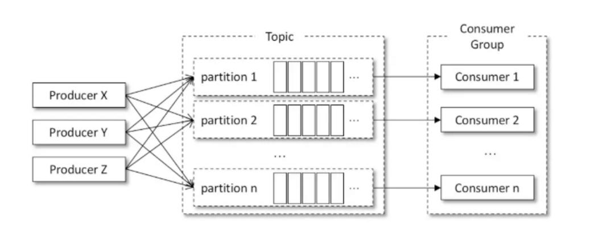

Kafka 官网：http://kafka.apache.org/

Kafka 中文文档：https://kafka.apachecn.org/

---

#### 1.Kafka 介绍及安装

> :alembic: Apache Kafka is an open-source distributed event streaming platform used by thousands of companies for high-performance data pipelines, streaming analytics, data integration, and mission-critical applications.
>
> Apache Kafka 是一个开源的<u>分布式流处理平台</u>，被数千家公司用于高性能数据管道、流分析、数据集成和关键任务应用程序。

Kafka 所具有的主要功能：

1. 发布&订阅：类似于一个消息系统，读写流式的数据。

   Kafka 很好地替代了传统的 message broker（消息代理）。

   与大多数消息系统相比，Kafka 拥有更好的吞吐量、内置分区、具有复制和容错的功能，这使它成为一个非常理想的大型消息处理应用。

2. 流处理：编写可扩展的流处理应用程序，用于实时事件响应的场景。

3. 存储：安全的将流式的数据存储在一个分布式，有副本备份，容错的集群。

 

> :o: 由于 Kafka 是基于 Scala 和 Java 开发，运行时需依赖 JDK 环境，除此之外，还要结合 Zookeeper 进行使用。

1. 安装 Zookeeper：见[分布式服务协调中间件-ZooKeeper](../分布式服务中间件/分布式服务协调中间件-ZooKeeper.md)

2. 在官网找到下载地址将压缩包下载到压缩包`/usr/local`目录下，由于 Kafka 运行需要 Scala 环境，所以我们要下载带 Scala 的压缩包`kafka_xxx-xxx.tgz`（第一个 xxx 代表 Scala 的版本）。

   ~~~shell
   [root@localhost local]# wget https://dlcdn.apache.org/kafka/2.8.0/kafka_2.13-2.8.0.tgz
   --2021-08-25 23:21:12--  https://dlcdn.apache.org/kafka/2.8.0/kafka_2.13-2.8.0.tgz
   正在解析主机 dlcdn.apache.org (dlcdn.apache.org)... 151.101.2.132, 2a04:4e42::644
   正在连接 dlcdn.apache.org (dlcdn.apache.org)|151.101.2.132|:443... 已连接。
   已发出 HTTP 请求，正在等待回应... 200 OK
   长度：71403603 (68M) [application/x-gzip]
   正在保存至: “kafka_2.13-2.8.0.tgz.1”
   
   kafka_2.13-2.8.0.tgz.1                                       100%[===========================================================================================================================================>]  68.10M  3.35MB/s  用时 63s     
   
   2021-08-25 23:22:17 (1.09 MB/s) - 已保存 “kafka_2.13-2.8.0.tgz.1” [71403603/71403603])
   
   [root@localhost local]# ls
   bin  etc  games  include  kafka_2.13-2.8.0.tgz  lib  lib64  libexec  sbin  share  src  zookeeper
   ~~~

3. 解压安装包：

   ~~~shell
   [root@localhost local]# tar -zxf kafka_2.13-2.8.0.tgz 
   [root@localhost local]# ls
   bin  etc  games  include  kafka_2.13-2.8.0  kafka_2.13-2.8.0.tgz  lib  lib64  libexec  sbin  share  src  zookeeper
   [root@localhost local]# rm kafka_2.13-2.8.0.tgz 
   rm：是否删除普通文件 'kafka_2.13-2.8.0.tgz'？y
   [root@localhost local]# mv kafka_2.13-2.8.0 kafka
   [root@localhost local]# ls
   bin  etc  games  include  kafka  lib  lib64  libexec  sbin  share  src  zookeeper
   ~~~

Kafka 各目录说明：

1. `bin` 目录：kafka 的可执行脚本目录，包括 kafka 服务进程，kafka 客户端等脚本。
2. `config` 目录：配置文件目录，server.properties 为服务配置文件。
3. `libs` 目录：kafka 依赖的包。
4. `site-docs` 目录：存放 kafka 相关文档。

Kafka 配置文件：配置文件是位于 config 目录下 server.properties 文件，需要修改几项配置

1. 配置 listeners 监听： 

   ~~~properties
   listeners=PLAINTEXT://localhost:9092
   advertised.listeners=PLAINTEXT://localhost:9092
   ~~~

   如果这里配置的 localhost 后续命令中则使用 localhost，如果这里配置具体 IP，后面命令则使用具体的 IP 地址。

2. 配置日志路径： `log.dirs=/var/log/kafka`。

Kafka 基本操作：

1. 启动 Kafka（启动前需要确认 Zookeeper 先启动）：

   ~~~shell
   [root@localhost bin]# pwd
   /usr/local/kafka/bin
   [root@localhost bin]# ./kafka-server-start.sh ../config/server.properties &
   
   ......
   
   [2021-08-25 23:40:07,010] INFO [KafkaServer id=0] started (kafka.server.KafkaServer)
   [2021-08-25 23:40:07,071] INFO [broker-0-to-controller-send-thread]: Recorded new controller, from now on will use broker 192.168.253.136:9092 (id: 0 rack: null) (kafka.server.BrokerToControllerRequestThread)
   ~~~

   此方式为非后台运行，如果需要后台运行，则使用：`bin/kafka-server-start.sh -daemon config/server.properties`

2. 停止 Kafka：`./kafka-server-stop.sh` 

>:closed_lock_with_key: Kafka 基本概念：
>
>1. Topic（主题）：消息主题，一个消息主题包含多个 Partitions。
>2. Partitions（分区）：消息的实际存储单位。
>3. Producer（生产者）：消息生产者。
>4. Consumer（消费者）：消息消费者。
>5. Broker（代理）：服务器上运行的 Kafka 的实例，在 Kafka 集群中每一个 Broker 对应一个唯一的 ID，即 BrokerId。

Kafka 主题 Topic 操作：

1. 创建主题 topic：

   ~~~shell
   [root@localhost kafka]# bin/kafka-topics.sh --zookeeper localhost:2181 --create --topic news --partitions 2 --replication-factor 1
   ~~~

   - `--zookeeper localhost:2181`：指定 zookeeper 地址。

   - `--create --topic news`：创建名称为 news 的主题。
   - `--partitions 2`：指定主题的分区数。
   - `--replication-factor 1`：每个分区的副本个数。

2. 查看所有主题：

   ~~~shell
   [root@localhost kafka]# bin/kafka-topics.sh --zookeeper localhost:2181 --list
   news
   ~~~

3. 查看主题详情：

   ~~~shell
   [root@localhost kafka]# bin/kafka-topics.sh --zookeeper localhost:2181 --describe --topic news
   Topic: news	TopicId: AXYK2TQCSoiT8wc6d7odgw	PartitionCount: 2	ReplicationFactor: 1	Configs: 
   	Topic: news	Partition: 0	Leader: 0	Replicas: 0	Isr: 0
   	Topic: news	Partition: 1	Leader: 0	Replicas: 0	Isr: 0
   ~~~

4. 创建消费者监听主题 news：

   ~~~shell
   [root@localhost kafka]# bin/kafka-console-consumer.sh --bootstrap-server localhost:9092 --topic news
   ~~~

   - `--bootstrap-server localhost:9092`：指定连接的 Kafka 集群地址。
   - `--topic news`：指定监听的主题。

   执行此命令后，shell 界面阻塞等待生产者发布消息。

5. 在开启一个 ssh 连接生产消息：

   ~~~shell
   [root@localhost kafka]# bin/kafka-console-producer.sh --broker-list localhost:9092 --topic news
   >Hello Kafka    #输入发布的消息
   ~~~

   - `--broker-list localhost:9092`：指定连接的 Kafka 集群地址。
   - `--topic news`：指定发布的主题。

   发布消息后，监听此主题的消费者就会收到消息。

   >  :green_salad: 上面的监听命令只会接受到开启监听段之后生产者所生产的消息，如果需要接收历史消息，需要额外添加参数：
   >
   > ~~~shell
   > [root@localhost kafka]# bin/kafka-console-consumer.sh --bootstrap-server localhost:9092 --topic news --from-beginning
   > xixixi
   > Hello Kafka
   > ~~~
   >
   > 生产者所生产的消息都将会被监听端所接收（顺序不一定）。

---

#### 2.Kafka API-客户端操作

Kafka 主要为我们提供了五类 API：

1. **AdminClient API**：允许管理和检测 Topic、Broker 以及其他 Kafka 实例，与 Kafka 自带的脚本命令作用类似。
2. **Producer API**：发布消息到 1 个或多个 Topic，也就是生产者或者说发布方需要用到的 API。
3. **Consumer API**：订阅 1 个或多个 Topic，并处理产生的消息，也就是消费者或者说订阅方需要用到的 API。
4. **Stream API**：高效地将输入流转换到输出流，通常应用在一些流处理场景。
5. **Connector API**：从一些源系统或应用程序拉取数据到 Kafka。

引入对应版本依赖：

~~~xml
<dependency>
    <groupId>org.apache.kafka</groupId>
    <artifactId>kafka-clients</artifactId>
    <version>2.8.0</version>
</dependency>
~~~

创建 AdminClient：

~~~java
public class AdminClientTest {
    public static void main(String[] args) {
        Properties properties = new Properties();
        properties.setProperty(AdminClientConfig.BOOTSTRAP_SERVERS_CONFIG, "192.168.253.136:9092");
        AdminClient adminClient = AdminClient.create(properties);
        System.out.println(adminClient);
        adminClient.close();
    }
}
~~~

创建 Topic：

~~~java
AdminClient adminClient = AdminClient.create(properties);
NewTopic newTopic = new NewTopic("order", 1, (short) 1);
CreateTopicsResult result = adminClient.createTopics(Collections.singleton(newTopic));
System.out.println(result);
adminClient.close();
~~~

> :desert_island: 需要远程连接 Kafka 时，配置文件的 listeners 不能使用 localhost。

查询 Topic：

~~~java
AdminClient adminClient = AdminClient.create(properties);
ListTopicsResult result = adminClient.listTopics();
result.names().get().forEach(System.out::println);
// 列出包含内部 Topic 的清单
ListTopicsOptions options = new ListTopicsOptions().listInternal(true);
ListTopicsResult optionResult = adminClient.listTopics(options);
optionResult.names().get().forEach(System.out::println);
adminClient.close();
---------------------------------------------------------
news
order
...
news
__consumer_offsets
order
~~~

查询 Topic 时，可以带 ListTopicsOptions 进行查询。

删除 Topic：

~~~java
AdminClient adminClient = AdminClient.create(properties);
adminClient.deleteTopics(Collections.singleton("news"));
adminClient.close();
~~~

查看 Topic 描述信息：

~~~java
AdminClient adminClient = AdminClient.create(properties);
DescribeTopicsResult result = adminClient.describeTopics(Collections.singleton("order"));
result.all().get().forEach((k,v) -> System.out.println(v.toString()));
adminClient.close();
---------------------------------------------------------
(name=order, internal=false, partitions=(partition=0, leader=192.168.253.136:9092 (id: 0 rack: null), replicas=192.168.253.136:9092 (id: 0 rack: null), isr=192.168.253.136:9092 (id: 0 rack: null)), authorizedOperations=null)
~~~

查看 Topic 描述信息：

~~~java
AdminClient adminClient = AdminClient.create(properties);
ConfigResource configResource = new ConfigResource(ConfigResource.Type.TOPIC, "order");
DescribeConfigsResult configs = adminClient.describeConfigs(Collections.singleton(configResource));
configs.all().get().forEach((k,v) -> System.out.println(v.toString()));
adminClient.close();
---------------------------------------------------------
Config(entries=[ConfigEntry(name=compression.type, value=producer, source=DEFAULT_CONFIG...
~~~

Topic 配置信息修改：

~~~java
AdminClient adminClient = AdminClient.create(properties);
Map<ConfigResource, Collection<AlterConfigOp>> configs = new HashMap<>();
ConfigResource configResource = new ConfigResource(ConfigResource.Type.TOPIC, "order");
Set<AlterConfigOp> configOps = Collections.singleton(new AlterConfigOp(new ConfigEntry("preallocate", "true"), AlterConfigOp.OpType.SET));
configs.put(configResource, configOps);
adminClient.incrementalAlterConfigs(configs);
DescribeConfigsResult configsResult = adminClient.describeConfigs(Collections.singleton(configResource));
System.out.println(configsResult.all().get().get(configResource).get("preallocate"));
adminClient.close();
~~~

增加 Topic 的 Partitions 数量：

~~~java
AdminClient adminClient = AdminClient.create(properties);
Map<String, NewPartitions> newPartitions = new HashMap<>();
newPartitions.put("order", NewPartitions.increaseTo(2));
adminClient.createPartitions(newPartitions);
adminClient.close();
~~~

---

#### 3.Kafka API-Producer

> :apple: 在 Kafka 中，所有的消息发送均以<u>异步</u>的方式进行发送。

Producer 异步发送实例：

~~~java
public class ProducerTest {
    public static void main(String[] args) {
        Properties properties = new Properties();
        properties.setProperty(ProducerConfig.BOOTSTRAP_SERVERS_CONFIG, "192.168.253.136:9092");
        properties.setProperty(ProducerConfig.KEY_SERIALIZER_CLASS_CONFIG, "org.apache.kafka.common.serialization.StringSerializer");
        properties.setProperty(ProducerConfig.VALUE_SERIALIZER_CLASS_CONFIG, "org.apache.kafka.common.serialization.StringSerializer");
        Producer<String, String> producer = new KafkaProducer<>(properties);
        Order order = newOrder("显示器");
        ProducerRecord<String, String> producerRecord = new ProducerRecord<>("order", order.getOrderId(), JSONUtil.toJsonStr(order));
        Future<RecordMetadata> sendResult = producer.send(producerRecord);
        producer.close();
    }
}
~~~

Producer 在发送数据后将会立即返回一个 Future\<RecordMetadata\> 供我们后续进行调用获取结果。

> :ear_of_rice: Kafka 默认提供了 String、Integer 等的序列化器，如果我们需要直接发送对象则需要自定义 StringSerializer。

Producer 异步回调发送实例：

~~~java
public class ProducerTest {
    public static void main(String[] args) {
        Properties properties = new Properties();
        properties.setProperty(ProducerConfig.BOOTSTRAP_SERVERS_CONFIG, "192.168.253.136:9092");
        properties.setProperty(ProducerConfig.KEY_SERIALIZER_CLASS_CONFIG, "org.apache.kafka.common.serialization.StringSerializer");
        properties.setProperty(ProducerConfig.VALUE_SERIALIZER_CLASS_CONFIG, "org.apache.kafka.common.serialization.StringSerializer");
        Producer<String, String> producer = new KafkaProducer<>(properties);
        Order order = newOrder("显示器");
        ProducerRecord<String, String> producerRecord = new ProducerRecord<>("order", order.getOrderId(), JSONUtil.toJsonStr(order));
        Future<RecordMetadata> sendResult = producer.send(producerRecord, new Callback() {
            @Override
            public void onCompletion(RecordMetadata recordMetadata, Exception e) {
                System.out.println("do something...");
            }
        });
        producer.close();
    }
}
~~~

Producer 消息发送过程：

1. 构建 KafkaProducer，构建过程如下：

   1. 初始化参数...

   2. 通过 RPC 远程调用获取 metadata，在 metadata 中包含整个 Kafka 集群信息，包括分区和 Broker。

   3. 创建累加器 accumulator：通过累加器来判断何时进行发送。

      在 KafkaProducer 中，消息以批量发送，当消息累计到具体数量或者时间超过某阈值时执行一次批量发送，具体的配置如下：

      ~~~java
      properties.setProperty(ProducerConfig.BATCH_SIZE_CONFIG, "16384");
      properties.setProperty(ProducerConfig.LINGER_MS_CONFIG, "1");      // ms 为单位
      ~~~

   4. 创建 sender 客户端并启动。

2. 执行 send 方法，执行的过程如下：

   1. 对消息头、Topic 进行序列化。

   2. 计算分区，判断消息应该进入哪一个分区。

   3. 将消息追加到 accumulator 中（accumulator.append）并获取追加的结果。

      > :dart: 代码中调用 send 方法时，实际上是将这一批消息累加到了 KafkaProducer 的 accumulator 中，然后在达到阈值时进行发送。

   4. 根据结果判断是否进行批量发送：

      ~~~java
      if (result.batchIsFull || result.newBatchCreated) {
          log.trace("Waking up the sender since topic {} partition {} is either full or getting a new batch", record.topic(), partition);
          this.sender.wakeup();
      }
      ~~~

   5. 将消息发送到指定分区的 leader 节点（Broker）上，由 Broker 进行存储。

在 KafkaProducer 中获取分区时，Kafka 默认分区机制为：

1. 如果 ProducerRecord 中指定了分区，则直接使用（可以在 KafkaProducer 构造器中进行指定）。
2. 如果未指定分区，但指定了 key 值，则根据 key 的 hash 值选择一个分区（相同的 key 所发送到的 Partition 是同一个，可保证消息的局部有序性）
3. 如果未指定分区，也未指定 key 值，则以 '黏性分区' 策略（2.4 版本以前使用轮询策略）选择一个分区。

部分代码如下：

~~~java
public int partition(String topic, Object key, byte[] keyBytes, Object value, byte[] valueBytes, Cluster cluster,
                     int numPartitions) {
    if (keyBytes == null) {
        return stickyPartitionCache.partition(topic, cluster);
    }
    // hash the keyBytes to choose a partition
    return Utils.toPositive(Utils.murmur2(keyBytes)) % numPartitions;
}
~~~

> :neutral_face: 黏性分区策略：择单个分区发送所有无 Key 的消息。一旦这个分区的 batch 已满或处于 "已完成" 状态，黏性分区器会随机地选择另一个分区并会尽可能地坚持使用该分区（像黏住这个分区一样）直到这个分区的 batch 也满了或处于 "已完成" 状态。

除此之外，我们还可以自定义分区策略（实现`org.apache.kafka.clients.producer.Partitioner`）并对 properties 进行配置：

~~~java
properties.setProperty(ProducerConfig.PARTITIONER_CLASS_CONFIG, "com.star.kafka.config.MyPartitioner");
~~~

---

#### 4.Kafka API-Consumer

Kafka 消费者概念：

1. Consumer Group：消费组是 Kafka 提供的可扩展且具有容错性的消费者机制，一个消费组包含多个消费者实例，它们共享一个公共的 Group ID，组内的所有消费者协调在一起来消费 Topics 的所有分区，每个 Partiton 只能被消费组内的某一个 Consumer 所消费。
2. Offset：偏移量专指 Partition 以及 Consumer Group 而言，记录某个 Consumer 在对应的 Partiton 中当前已经消费到达的位置；如果某消费者宕机，接替的消费者将从 Offset 处重新开始消费消息。

Kafka 中 Offset 的管理方式：

在 0.9 版本之前，Kafka 将 Offset 保存在 Zookeeper 中，但 Zookeeper 并不适合进行大批量的读写操作。在此之后，Kafka 通过内部主题 `__consumer_offsets`来管理 Offset 信息，每个 Consumer 将 Offset 消息发送至该主题。

Kafka 集群启动时，Kafka 就会自动创建位移主题，默认的分区数是 50，副本数是 3。

Comsumer 提交位移的方式：

1. 自动提交位移：Kafka 默认定期自动提交位移。

   ~~~properties
   enable.auto.commit=true
   auto.commit.interval.ms=1
   ~~~

   每隔`auto.commit.interval.ms`所指定的毫秒数后，Consumer 便会自动提交 Offset 到内部主题`__consumer_offsets`中。

   ~~~java
   public class ConsumerTest {
       public static void main(String[] args) {
           Properties properties = new Properties();
           properties.setProperty(ConsumerConfig.BOOTSTRAP_SERVERS_CONFIG, "192.168.253.136:9092");
           properties.setProperty(ConsumerConfig.GROUP_ID_CONFIG, "store_system");
           properties.setProperty(ConsumerConfig.KEY_DESERIALIZER_CLASS_CONFIG, "org.apache.kafka.common.serialization.StringDeserializer");
           properties.setProperty(ConsumerConfig.VALUE_DESERIALIZER_CLASS_CONFIG, "org.apache.kafka.common.serialization.StringDeserializer");
           Consumer<String, String> consumer = new KafkaConsumer<>(properties);
           // 订阅 order 主题
           consumer.subscribe(Collections.singleton("order"));
           while (true) {
               // 每隔一秒拉取一次消息
               ConsumerRecords<String, String> records = consumer.poll(Duration.ofSeconds(1L));
               records.forEach(record -> System.out.println(record.toString()));
           }
       }
   }
   ~~~

   > :baby_chick: Consumer 除了订阅主题以外，还可以指定分区进行订阅：
   >
   > ~~~java
   > TopicPartition tp = new TopicPartition("order", 0);
   > consumer.assign(Collections.singleton(tp));
   > ~~~

2. 手动提交位移：设置`enable.auto.commit=false`，然后在代码中进行手动提交。

   ~~~JAVA
   while (true) {
       // 每隔一秒拉取一次消息
       ConsumerRecords<String, String> records = consumer.poll(Duration.ofSeconds(1L));
       try {
           // 处理数据
           records.forEach(record -> System.out.println(record.toString()));
       }catch (Exception e) {
           // 进行回滚不提交 Offset
       }
       // 所有 records 处理成功后提交 Offset
       consumer.commitSync();
   }
   ~~~
   
   

:black_flag: 分 Partition 进行 Offset 提交：

~~~java
while (true) {
    // 每隔一秒拉取一次消息
    ConsumerRecords<String, String> records = consumer.poll(Duration.ofSeconds(1L));
    records.partitions().forEach(partition -> {
        // 获取这一批消息中包含的分区
        List<ConsumerRecord<String, String>> partitionRecords = records.records(partition);
        try {
            // 按分区处理数据
            partitionRecords.forEach(record -> System.out.println(record.toString()));
        }catch (Exception e) {
            // 进行回滚
        }
        // 当一个分区的 records 处理成功后提交该分区的 Offset
        long offset = partitionRecords.get(partitionRecords.size() - 1).offset();
        OffsetAndMetadata offsetAndMetadata = new OffsetAndMetadata(offset + 1);
        consumer.commitSync(Collections.singletonMap(partition, offsetAndMetadata));
    });
}
~~~

分 Partition 进行 Offset 提交的好处：当消费者接收到一批消息时，这批消息可能来自多个分区，如果统一进行 Offset 提交则只有当这一批消息都处理成功才能提交。如果分 Partition 进行 Offset 提交，则我们可以允许部分 Partition 成功而部分 Partition 失败，此时我们只需要重新消费处理消息失败的 Partition 即可。

Consumer 多线程消费可以分为两种实现方式：

1. 每一个 Partition 对应一个 Consumer 线程，Consumer 线程负责消息的获取和处理，此种方式保证了线程安全，实现起来也比较简单。

   

   此种方式消费数据的缺点：

   1. 消费者的个数受限于 Partition 的数量，无法很好地进行扩展。
   2. 在每一个线程中都维护了一个 Consumer 对象，占用的系统资源较大。

2. 由一个或几个 Consumer 专门负责消息获取，然后交由处理数据的线程池进行处理：

   

   此种方式消费数据的并发能力高且容易扩展，但是也存在着一些缺点：

   1. 无法感知数据处理线程的处理结果，可能会丢失数据。

应用场景：

- 如果是对数据的一致性要求较高的场景，则需要采用多 Consumer 的处理方式。
- 如果是处理流式数据，对数据的准确性要求不高，则使用第二种多线程的方式更为合适。

手工控制 offset 位置：在实际的消费过程中，如果我们在发生错误后需要重复消费，或者是使用了第三方组件来记录 Offset（如 Redis），我们在消费时还可以手动指定 Offset 位置:

~~~java
while (true) {
    // 每隔一秒拉取一次消息
    ConsumerRecords<String, String> records = consumer.poll(Duration.ofSeconds(1L));
    // 从头开始获取消息
    consumer.seekToBeginning(records.partitions());
    records.partitions().forEach(partition -> {
        List<ConsumerRecord<String, String>> partitionRecords = records.records(partition);
        try {
            // 处理数据
            partitionRecords.forEach(record -> System.out.println(record.toString()));
        }catch (Exception e) {
            // 进行回滚
        }
        long offset = partitionRecords.get(partitionRecords.size() - 1).offset();
        OffsetAndMetadata offsetAndMetadata = new OffsetAndMetadata(offset + 1);
        consumer.commitSync(Collections.singletonMap(partition, offsetAndMetadata));
    });
}
~~~

> :cactus: 除此之外，Consumer 还提供了 pause 和 resume 方法，可以结合<u>令牌桶</u>进行流量控制。

---

#### 5.Kafka 消息传递保障

:kimono: 在 Kafka 中对消息传递的保障有下列三种担保语义：

1. 最多一次：消息可能丢失，但绝不会重发。
2. 最少一次：消息绝不会丢失，但有可能重新发送。
3. 正好一次：每个消息传递一次且仅一次。

Producer 端对着三种语义的支持：

Kafka 中通过配置 acks 来控制 Broker 对 Producer 的应答策略，具体的值和说明如下：

| 参数     | 说明                                                         |
| -------- | ------------------------------------------------------------ |
| acks=0   | 如果设置为零，那么生产者根本不会等待来自服务器的任何确认。该记录将立即添加到套接字缓冲区并视为已发送。在这种情况下不能保证服务器已经收到记录，并且 retries 配置不会生效,每个记录返回的偏移量将始终设置为 -1。 |
| acks=1   | 如果设置为壹，这意味着 leader 节点会将记录写入其本地日志，但会在不等待所有 follower 节点的完全确认的情况下进行响应。在这种情况下，如果 leader 节点在确认记录后立即失败，但 follower 节点还未进行复制，则记录将丢失。 |
| acks=all | 这意味着 leader 节点将等待完整的同步副本集确认记录。这保证了只要至少一个同步副本还活着，记录就不会丢失，是最强的可用保证。 |

当我们配置`acks=0`或者禁用`retries`时，就实现了`最多一次`的担保语义；如果配置`acks=all`并启动`retries`时，则实现了`最少一次`的担保语义。

当 acks 的值为 1 或 all 时，如果 Broker 报告失败，Producer 则会根据 retries 配置进行重试，如果 Broker 已经记录了数据但是因为网络原因未正确返回成功到 Producer 时，消息可能会重复，Kafka 通过两种方式来保证消息的生产不产生重复：

1. 幂等传递：Kafka 在 Broker 中为每个生产者分配一个 ID，并通过生产者发送的序列号为每个消息进行去重。

   开启幂等性`enable.idempotence=true`，同时还需要满足几个要求：

   1. **retries** 在指定重试次数的时候，这个参数必须大于 0，默认为`Integer.MAX_VALUE`。
   2. **max.in.flight.requests.per.connection** 这个参数必须大于等于 5，默认为 5。
   3. **acks** 必须指定为 -1（all）。

   注意：<u>幂等性只能保证单个主题的单个分区上不出现重复消息，如果要实现多个分区的幂等性必须使用事务</u>。

2. 使用事务：使用时需要设置 Producer 的 transactional.id 例如`transactional.id=producer-01`。

   事务使用代码如下：

   ~~~java
   producer.initTransactions();
   try {
       producer.beginTransaction();
       // 发送多次消息...
       Future<RecordMetadata> sendResult = producer.send(producerRecord);
       // 发送多次消息...
       producer.commitTransaction();
   }catch (Exception e) {
       producer.abortTransaction();
   }
   ~~~

   在使用事务时，还需要对 Consumer 设置`isolation.level`参数的，当前这个参数有两个取值：

   1. `read_uncommitted`：这是默认值，表明 Consumer 能够读取到 Kafka 写入的任何消息，不论事务型 Producer 提交事务还是终止事务，其写入的消息都可以读取。很显然，如果你用了事务型 Producer，那么对应的 Consumer 就不要使用这个值。
   2. `read_committed`：表明 Consumer 只会读取事务型 Producer 成功提交事务写入的消息。当然了，它也能看到非事务型 Producer 写入的所有消息。

Consumer 端对着三种语义的支持：

消费者在消费消息时一般分为 3 个步骤：读取消息、处理消息，保存消息的位置（Offset），不同的执行顺序可以实现不同的语义支持：

1. 读取消息、保存消息的位置、最后处理消息：在这种情况下，有可能消费者保存了位置之后，但是处理消息输出之前崩溃了，此时接管处理的进程会在已保存的位置开始，即使该位置之前有几个消息尚未处理成功。这对应于`最多一次`的担保语义。
2. 读取消息、处理消息、最后保存消息的位置：在这种情况下，可能消费进程处理消息之后，但保存它的位置之前崩溃了，此时新的进程将接收已经被处理的前几个消息，这就符合了`至少一次`的语义（在多数情况下消息有一个主键，业务系统可以编写相关逻辑对重复消费的消息进行去重）。

如果要实现`正好一次`的担保语义，也就代表着处理消息，保存消息的位置这两个动作必须在同一个事务当中，有两种方式可以进行实现：

1. 在保存消息的位置和处理消息之间引入**<u>两阶段提交</u>**。

2. 将 Offset 保存在处理消息（存储消息）的系统当中。

   例如：处理消息是将消息存在 MySQL 中，则将 Offset 也保存在 MySQL 中，保存 Offset 和保存消息使用同一个事务进行。

   

> :ear_of_rice: 综上所述：Kafka 默认是保证`至少一次`传递，并允许用户通过禁止生产者重试和处理一批消息前提交它的偏移量来实现`最多一次`传递，而`正好一次`传递需要与目标存储系统合作，但 Kafka 提供了偏移量，实现起来也比较简单。

---

#### 6.Kafka API-Stream

Kafka Stream 是处理存储在 Kafka 的数据的客户端程序库。

> :dragon_face: Kafka Stream 基本概念：
>
> 1. Stream（流）：Kafka 中流代表一个无限的，不断更新的数据集，一个 Stream 是一个有序的，允许重放的不可变的数据记录，其中数据记录被定义为一个容错的键值对。
> 2. Processor Topology（处理拓扑）：流处理拓扑定义了由流数据处理的计算逻辑，相当于流程图。
> 3. Stream Processor（流处理器）：流处理器用来处理拓扑中的各个节点，它代表拓扑中的每个处理步骤，用来完成数据转换功能；除一般的处理器外，Kafka 中还有两种特殊的处理器：
>    1. 源处理器：该处理器没有任何上游处理器，它从 Kafka 的一个或多个主题消费数据作为处理拓扑的输入流，将该输入流发送到下游处理器。
>    2. Sink 处理器：该处理器没有任何下游处理器，它将从上游处理器接收到的任何数据发送到指定的主题当中。

流处理状态：

1. 一些流处理应用不需要状态，这意味着每个消息的处理都是彼此独立的。如果你只需要进行消息转换，或者基于某些条件进行筛选，那么你的流处理应用程序的拓扑会非常简单。
2. 然而，能够保存状态，使得流处理系统可以应用在更多场景。你可以进行 Join、Group by 或者 aggregate 操作，Kafka Streams 就是这种包含状态的流处理。

使用 Kafka Stream 需要引入依赖：

~~~xml
<dependency>
    <groupId>org.apache.kafka</groupId>
    <artifactId>kafka-streams</artifactId>
    <version>2.8.0</version>
</dependency>
~~~

使用 Kafka Stream 编写 Word Count 流计算实例：

1. 创建两个 Topic，一个用来接收存储在 Kafka 的数据，一个用于输出警告流处理完成后的数据。

2. 编写流处理程序：

   ~~~java
   public class StreamTest {
       public static void main(String[] args) {
           Properties properties = new Properties();
           properties.setProperty(StreamsConfig.BOOTSTRAP_SERVERS_CONFIG, "192.168.253.136:9092");
           properties.setProperty(StreamsConfig.APPLICATION_ID_CONFIG, "stream_application");
           properties.setProperty(StreamsConfig.DEFAULT_KEY_SERDE_CLASS_CONFIG, ClassUtil.getClassName(Serdes.String().getClass(), false));
           properties.setProperty(StreamsConfig.DEFAULT_VALUE_SERDE_CLASS_CONFIG, ClassUtil.getClassName(Serdes.String().getClass(), false));
           // 构建流
           StreamsBuilder streamsBuilder = new StreamsBuilder();
           // 流处理拓扑
           countWord(streamsBuilder);
           KafkaStreams streams = new KafkaStreams(streamsBuilder.build(), properties);
           // 开启流
           streams.start();
       }
   
       public static void countWord(final StreamsBuilder streamsBuilder) {
           KStream<String, String> sources = streamsBuilder.stream("stream_in");
           // 将 values 进行 flatMap 
           KTable<String, Long> count = sources.flatMapValues(text -> Arrays.asList(text.toLowerCase().split(" ")))
                   .groupBy((k, v) -> v)
                   .count();
           // 输出键值对到 stream_out 这个 Topic 中，其中 key 为 string 类型，value 为 long 类型
           count.toStream().to("stream_out", Produced.with(Serdes.String(), Serdes.Long()));
       }
   }
   ~~~

3. 向`stream_in`这个 Topic 发送文字消息。

4. 监听`stream_out`（需指定一些参数）：

   ~~~shell
   /usr/local/kafka/bin/kafka-console-consumer.sh --bootstrap-server 192.168.253.136:9092 --topic stream_out\
    --property print.key=true --property print.value=true\
    --property key.deserializer=org.apache.kafka.common.serialization.StringDeserializer\
    --property value.deserializer=org.apache.kafka.common.serialization.LongDeserializer\
    --from-beginning
   ~~~

向`stream_in`发送文字消息时，Kafka Stream 将会持续性地对流数据进行统计处理并输出到`stream_out`中。

KStream（事件流）和 KTable（changelog 流）：

1. KStream 就是数据流，它不间断地获取 Topic 中的内容，并且每一次获取都是向其中插入新数据（insert）。

2. KTable 类似于传统数据库，它是截止到某一个窗口时间内的数据集合的抽象，每一次操作，都是更新插入（upsert）。

   KTable负责抽象的，就是表状数据。每一次操作，都是更新插入（upsert）。

---

#### 7.Kafka API-Connect

Kafka Connect 是 Kafka 流式计算的一部分，主要用来跟其他中间件建立流式通道。

Kafka Connect 提供了一套统一的 API 用来与其他系统的集成，目前已经有很多开源的和商业版本的 Kafka Connect 实现。

---

#### 8.Kafka 集群

---

#### 9.Kafka 集群监控

---

#### 10.Kafka 集成微服务

---

#### 11.Kafka 常见面试题