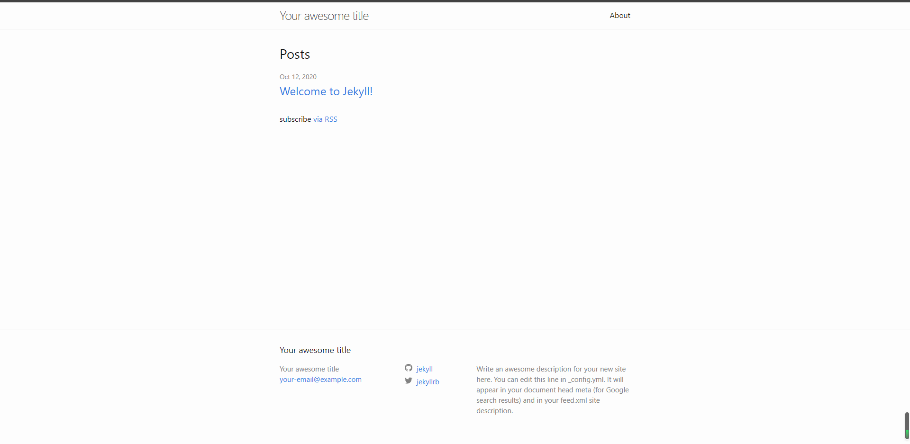

***Jekyll*** 是一个静态博客网站生成器，可以直接将纯文本（Markdown、Textile）构建可发布的静态网站。支持自定义地址、博客分类、页面、文章以及自定义的布局设计，*GitHub Page* 也基于 ***Jekyll*** 进行构建。

Jekyll 官网：[官方网站](http://jekyllcn.com/)

**目录**

1. [Jekyll 安装](#1Jekyll安装)
2. [使用 Jekyll 构建网页](#2使用Jekyll构建网页)

---

#### 1.Jekyll安装

系统：Windows 10 专业版

> 安装 Jekyll 之前，需要先安装 Ruby。

1. 安装 **Ruby**

   下载安装包：[下载地址](https://rubyinstaller.org/downloads/)

   官网下载安装包速度较慢，可以到 GitHub 上进行下载：[GitHub 下载地址](https://github.com/oneclick/rubyinstaller2)。

   下载 Ruby 时，可以分别下载 **Ruby** 和开发工具包 **Devkit**，安装 Ruby 后再安装开发工具包；同时官方也提供了 Ruby 安装包与开发工具包结合的安装程序*rubyinstaller-devkit-2.7.2-1-x64.exe*，直接下载安装即可。

   下载完成后，选择合适的安装目录，一直 next 即可。

   检查 Ruby 是否安装完成：

   ~~~cmd
   C:\Users\star>ruby -v
   ruby 2.7.2p137 (2020-10-01 revision 5445e04352) [x64-mingw32]
   ~~~

   检查 Ruby 的软件包管理器 Gems 是否安装完成：

   ~~~cmd
   C:\Users\star>gem -v
   3.1.4
   ~~~

   以上步骤确认无误后，即可进行安装 ***Jekyll***。

2. 安装  **Jekyll**

   进入 windows cmd 命令行，输入命令：

   ~~~cmd
   C:\Users\star>gem install jekyll
   ~~~

   等待执行完毕即可。

3. **Jekyll** 基本使用

   使用 Jekyll 创建目录：

   ~~~cmd
   C:\Users\star>
   C:\Users\star>d:
   D:\>jekyll new test
   Running bundle install in D:/test...
   
   ......
   
   New jekyll site installed in D:/test.
   D:\>
   ~~~

   进入目录并运行服务：

   ~~~cmd
   D:\>cd test
   
   D:\test>bundle exec jekyll serve
   Configuration file: D:/test/_config.yml
               Source: D:/test
          Destination: D:/test/_site
    Incremental build: disabled. Enable with --incremental
         Generating...
          Jekyll Feed: Generating feed for posts
                       done in 0.689 seconds.
    Auto-regeneration: enabled for 'D:/test'
       Server address: http://127.0.0.1:4000/
     Server running... press ctrl-c to stop.
   ~~~

   访问 http://127.0.0.1:4000/ 查看页面：

   
 </img> 

Jekyll 各个目录及作用：

- 

---

#### 2.使用Jekyll构建网页